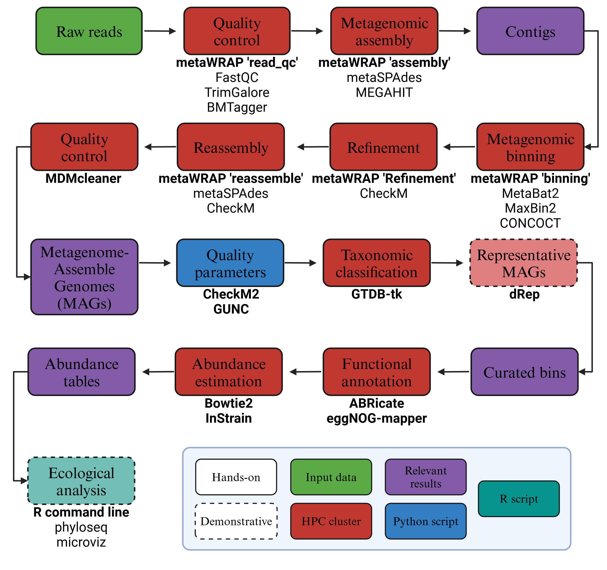

# Workshop "Metagenomics analysis of the human gastrointestinal microbiome"

- - - -

> This workshop is organized by the CABANAnet network in collaboration with the Cellular and Molecular Biology Research Center (CIBCM) and Informatics Center (CI) from the University of Costa Rica (UCR)

* ***Coordinator:***
  * *Ph.D. Rebeca Campos-Sánchez: Principal Investigator from the Cellular and Molecular Biology Research Center (CIBCM, UCR). Expertise in clinical and human genomics and metagenomics. [Google Scholar](https://scholar.google.com/citations?user=5Jdh-RkAAAAJ&hl=en&oi=ao)*

* ***Instructor:***
  * *B.Sc. Dorian Rojas-Villalta: Secondee at the Cellular and Molecular Biology Research Center (CIBCM, UCR). Expertise in bacterial genomics and metagenomics. [Google Scholar](https://scholar.google.com/citations?user=kyLnECwAAAAJ&hl=en)*

- - - -

## Description

Recent discoveries about the role of the gastrointestinal microbiome in human health raised pertinent research. At the same time, the accelerated development of -omics sciences has favored the study of the microbiome through techniques such as metataxonomics and metagenomics. Shotgun metagenomics has gained the most attention due to its advantages (e.g. direct annotation of the microbiome functional role, greatest profiling depth). Therefore, expanding knowledge regarding metagenomics data analysis is required to incentivize the use and application of this scheme. This workshop aims to teach the basics of interpretation and analysis of metagenomics sequences through the institutional high-performance computing cluster of the UCR.

During the workshop, a previously sequenced dataset will be used. These reads correspond to one healthy (SRR8555091) and one acute diarrhea disease patient (SRR9988196) fecal samples. Through analyzing these sequences, we will explore:

Topic | Sub-topic | Used bioinformatics tools
:------|:--------|--------:
Human gastrointestinal microbiology and sequencing fundaments|- Physiological role of microbiome  - Omics sciences, New Generation Sequencing technologies, and bioinformatic data format|None
Computational cluster usage|- Cluster organization - Usage guidelines  Basic Unix commands|None
Quality control and filtering of human metagenomics sequences|- phred quality scale - Decontamination of human reads - Quality interpretation|metaWRAP_READ_QC (FastQC, TrimGalore, BMTagger)
*De novo* assembly of bacterial metagenomes|- Contigs assembly -Binning of metagenome-assembly genomes (MAGs) -Refinement and reassembly of MAGs|metaWRAP_ASSEMBLY (metaSPAdes, MEGAHIT) metaWRAP_BINNING (MetaBat 2, MaxBin2, CONCOCT) metaWRAP_REFINEMENT (CheckM) metaWRAP_REASSEMBLE_BINS (SPAdes, CheckM)
MAGs quality evaluation|- High-, middle-, and low-quality MAGs - Quality, completeness, and contamination calculation|MDMcleaner CheckM2 GUNC
Functional and taxonomic annotation of MAGs|- Taxonomic annotation of MAGs - Selection of representative MAGs - Identification of metabolic pathwats - Annotation of antibiotic resistance genes|GTDBtk dRep  ABRicate eggNOG-mapper
Ecological characterization of the microbiome|- Estimation of relative abundances - Alpha and Beta diversity indexes - Statistical analysis|Bowtie2 InStrain R command line (phyloseq, microviz)

### Each class related to coding and analysis is separated into different markdown files

[Class 1: Basic Unix shell Bash commands and workshop methodology](docs/Class_1/Class1.md)

[Class 2.1: Quality control and filtering of metagenomics sequences](docs/Class_2/Class2_1.md)

[Class 2.2: Metagenome-assembled genomes (MAGs) assembly, binning, refinement, reassemble](docs/Class_2/Class2_2.md)

[Class 3: MAGs quality evaluation](docs/Class_3/Class_3.md)

[Class 4: Functional and taxonomical annotation of MAGs](docs/Class_4/Class4.md)

[Class 5: Ecological characterization of the microbiome](docs/Class_5/Class5.md)

Additional material will be provided through the [Google drive](https://drive.google.com/drive/folders/1GJg8bVriWXvrmJ6LAp1R9m4SdZDVOEXl?usp=sharing).
