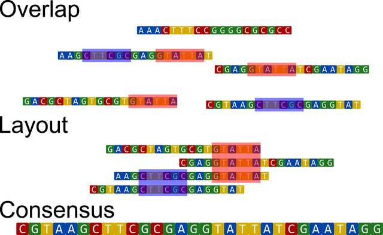
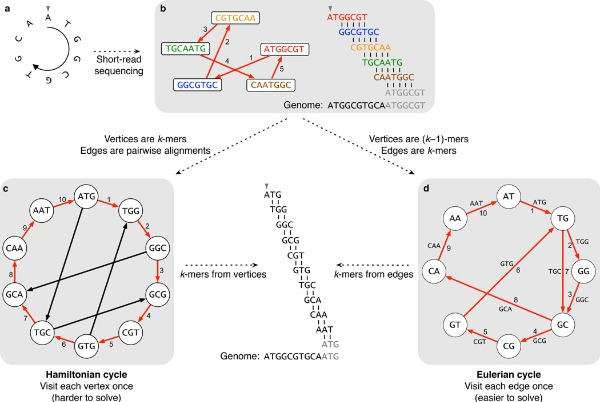

# Class 2.2: Metagenome-assembled genomes (MAGs) assembly, binning, refinement, reassemble

- - - -

## Metagenomic assembly (metaWRAP assembly module)

Sequencing reads are produced randomly and there is no particular order in how DNA or RNA sequences appear in `.fastq` files. Therefore, it is impossible and inaccurate to interpret the raw data as complete or ordered genomes. To reconstruct the genome of organisms the computational process of genome assembly must be undergone. For this, it is common to align the raw reads which is a computationally demanding process.

Genome aseemble have two main algorithms: the Overlap Layout Consensus (OLC) and Debruijn Graph (DBG). The lastest is the most used and implemented in current assembler. In some cases, a circular bacterial genome can be obtained by assembly. However, when unresolvable repeats (without connection) are present, the assembly is broken into fragments called contigs (short for contiguous). Contigs do not contain gaps and are the most common form in which uncomplete assemblies can be found. These contigs can be assembled into scaffolds by ordering and orienting them correctly, creating gaps filled with NNN's.

The OLC methods is purely based on the aligment of each sequenced reads in an attempt to find overlaps. When overlaps are found, a sequence consensus is determined and contigs/scaffolds are constructed. Image from [Goussarov et al. 2022](https://onlinelibrary.wiley.com/doi/10.1002/mbo3.1298).



De Bruijn Graph or k-mer method is more complex. In this scheme, reads are first chopped into k-mer (short substrings of k length). Using these k-mer, the DBG are constructed. These are directional graph were the vertices represent the k-mers' prefixes and suffixes (k-1 mer) that are conected by edges (the input k-mers). Once the graph is constructed, the Eulerian cycle is determined. Eulerian cycle is defined as the path through the graph that visits every edge once and starts and ends in the same vertix. This allows to reconstruct the genome by following successive edges shifted by one position. DBG came as a solution to previous methods as the Hamiltonian cycle which was harder to solve computationally and inefficient in large graphs. Image from [Compeau et al. 2011](https://www.nature.com/articles/nbt.2023).



The length of k-mers is an important parameter in assemblies. Small k-mers require less computational resources and have more posibilities of forming edges (although this might result in ambigous assemblies). However, they do not perform well in genomes or contigs with repetitive sequences. On the other hand, large k-mers fix the repetitive sequences issues and provides a more accurate assembly due to increasing the number of vertices in the graph. Though, finding the overlaps (edges) of these k-mers is complex, and this configuration is computationally demanding.

Moreover, there are two types of genome assemblies: *de novo* and reference-based assembly. *De novo* assembly is where the genome is constructed from scratch without any reference data. Reference-based genomes are designed based on the alignment of raw reads to a genomic reference (e.g. a complete genome of a closely related specie). This later type is computationally simpler, easier, and quicker. However, considering the nature of the metagenomic data, it is unfeasible.

Specifically for shotgun metagenomic assembly, there are two main approaches: individual assembly or by co-assembly. The individual assembly approach assembles all reads of a particular sample, while in co-assemblies reads from all samples (or a group) are used. Co-assemblies favors the assembly of genes with low abundance in individual samples; however, it mixes diversity of closely related strain which might induce biases depending on the research aim. In addition, co-assemblies require considerably more computational resources than individual assemblies.

For this workshop, metagenomic samples will be assembled through the De Bruijn Graph technique in a individual assembly approach using the metaWRAP assembly module.

### MetaWRAP assembly module

The metaWRAP assembly module allows to choose which between the assemblers [metaSPAdes](https://github.com/ablab/spades) and [MegaHit](https://github.com/voutcn/megahit). MetaSPAdes result in better assemblies than MEGAHIT. However, this later is faster and memory efficient, which might come handy for large datasets.

First, metaSPAdes is part of a toolkit called SPAdes (St. Petersburg genome Assembler) initially designed for *de novo* assembly and analysis of Illumina sequencing data. In the last years, it has been modified to work with other data (e.g. PacBio, Oxford Nanopore). Although the toolkit worked only for genomic assemblies, it was updated to conduct the assembly of metagenomic data, transcriptomes, plasmids, virus, among others. The metagenomic-specific assembler (metaSPAdes) showed high-quality assemblies in various environments in comparison to other softwares ([Nurk et al. 2017](https://genome.cshlp.org/content/27/5/824)). In bioinformatics, it is considered that SPAdes is the golden standard for assemblies.

MEGAHIT is a ultra-fast and memory efficient *de novo* assembler optimized for metagenomic datasets. At the moment, MEGAHIT demonstrated a superior performance over other metagenomic assembler ([Li et al. 2015](https://academic.oup.com/bioinformatics/article/31/10/1674/177884?login=false)). However, it was surpassed by metaSPAdes after its release.

Both of these *de novo* assemblers work with De Bruijn Graph schemes. Particularly, MEGAHIT uses succinct De Bruijn Graphs, a compressed version of the original DBG. This is part of the reason MEGAHIT has a fastest and more memory-efficient performance.

MetaWRAP assembly module has MEGAHIT as the default assembler due to its scalability to large datasets. However, the use of metaSPAdes can be indicated by a flag through command line. The final assembled contigs are sorted by length, and include contig ID, length, and coverage in the name. In additions, those scaffolds shorter than 1000bp. Finally, the module produces an assembly report using [QUAST](https://github.com/ablab/quast).

QUAST (QUality ASsessment Tool) was developed to evaluate the quality of assemblies using different metrics (which are explore after running). This toolkit includes the extension to evaluate metagenomic assemblies (MetaWQUAST), which is the one used in the metaWRAP assembly module. This extension works similar to the original QUAST and reporte the same metrics, but it is optimized to some specific metagenomic data features (great species diversity, unknown species, and relative genomes). Most evaluations are performed *de novo/. However, QUAST presents the option to conduct reference-based assessments.

To evaluate the metagenome, MetaQUAST alings the 16S rRNA gene sequences from the SILVA database. From the detected species, the strain with the best score is remained in the assembly. The top 50 microbes are blasted against the NCBI and the least fragmented genomes are downloaded. These are filtered to avoid genomes with coverage less than 10%. Although if the coverage is low for all sequencies, the list is not modified. Then, MetaQUAST uses these sequences as reference to evaluate the genome.

The final output from QUAST are report file in different format, including one `report.html` for a user-friendly visualization.

### Running metawrap assembly

In the terminal, call the metawrap assembly module and evaluate the arguments and flags specified in the usage menu.

```bash
(metawrap-env) [dorian.rojas@accessnode home]$ metawrap assembly -h
metawrap assembly -h

Usage: metaWRAP assembly [options] -1 reads_1.fastq -2 reads_2.fastq -o output_dir
Options:

        -1 STR          forward fastq reads
        -2 STR          reverse fastq reads
        -o STR          output directory
        -m INT          memory in GB (default=24)
        -t INT          number of threads (defualt=1)
        -l INT          minimum length of assembled contigs (default=1000)

        --megahit       assemble with megahit (default)
        --metaspades    assemble with metaspades instead of megahit (better results but slower and higher memory requirement)


real    0m0,013s
user    0m0,006s
sys     0m0,007s
```

Type the code in the `.slurm` file to perform a simple metagenomic assembly using metaSPAdes with output in a `3-assembly` directory. Specify the `-m` flag to 1000 for a faster performance.

> Remember to chance the running code in the `batch.sh` file.

The metagenomic assembly takes a considerable time running in the samples (over 1 day). Therefore, to continue with the workshop, analyze the data from the common repository where all the intermediate files are allocated (`/home/public/met-workshop`).

The output from the assembly module is more complex than the previous analyze module.

```bash
(metawrap-env) [dorian.rojas@accessnode test]$ ls -F 3-assembly/SRR9988205_sub/*
3-assembly/SRR9988205_sub/assembly_report.html  3-assembly/SRR9988205_sub/final_assembly.fasta

3-assembly/SRR9988205_sub/megahit:
done  final.contigs.fa  intermediate_contigs/  log  long.contigs.fa  opts.txt

3-assembly/SRR9988205_sub/metaspades:
assembly_graph.fastg               input_dataset.yaml        long_scaffolds.fasta.pac
assembly_graph_with_scaffolds.gfa  K21/                      long_scaffolds.fasta.sa
before_rr.fasta                    K33/                      misc/
contigs.fasta                      K55/                      params.txt
contigs.paths                      long_scaffolds.fasta      scaffolds.fasta
corrected/                         long_scaffolds.fasta.amb  scaffolds.paths
dataset.info                       long_scaffolds.fasta.ann  spades.log
first_pe_contigs.fasta             long_scaffolds.fasta.bwt  unused_by_metaspades.fastq

3-assembly/SRR9988205_sub/QUAST_out:
basic_stats/  icarus_viewers/  report.html  report.tex  report.txt             transposed_report.tsv
icarus.html   quast.log        report.pdf   report.tsv  transposed_report.tex  transposed_report.txt
```

> This shows only one sample's directory. However, you should have one per sample.

Notice there are two folders with the name of `megahit` and `metaspades`. Although the code indicates metaWRAP to use metaSPAdes as the default assembler, the wrapper applies and interesting approach to imporve the assembly. MetaWRAP does a normal assembly with metaSPAdes and unassembled reads are assembled with MEGAHIT. Both assemblies are concatenated and sorted in the output file `final_assembly.fasta` for a more complete assembly.

This final assembly is the one analyzed through QUAST. The QUAST results can be found in the folder `QUAST_out`. As mentioned above, the `report.html` file can be downloaded into the computer for a user-friendly visualization. Here, print the `report.txt` file.

```vim
All statistics are based on contigs of size >= 500 bp, unless otherwise noted (e.g., "# contigs (>= 0 bp)" and "Total length (>= 0 bp)" include all contigs).

Assembly                    final_assembly
# contigs (>= 0 bp)         2553
# contigs (>= 1000 bp)      2552
# contigs (>= 5000 bp)      587
# contigs (>= 10000 bp)     229
# contigs (>= 25000 bp)     35
# contigs (>= 50000 bp)     3
Total length (>= 0 bp)      10957886
Total length (>= 1000 bp)   10957464
Total length (>= 5000 bp)   6549908
Total length (>= 10000 bp)  4122326
Total length (>= 25000 bp)  1258310
Total length (>= 50000 bp)  187707
# contigs                   2552
Largest contig              80618
Total length                10957464
GC (%)                      46.32
N50                         6568
N75                         3060
L50                         399
L75                         1012
# N's per 100 kbp           21.81
```

These are the basic statistical parameters to be analyzed in assemblies. Total contigs (`# contigs`), Largest contig, Total length, N50, and L50 are among the most relevant to take in consideration.

Parameter|Definition|Interpretation
-----|----------|--------------:
Total contigs|Total number of contigs found in the metagenome|-
Largest contigs|Largest contigs in the metagenome|-
Total length|Total number of bp of the metagenome|-
N50|Length of the contigs that covers the 50% of the metagenome|The closer to the Largest contigs, the less fragmented is the metagenome
L50|Number of the contigs that covers the 50% of the metagenome|The closer to the Total contigs, the more fragmented the metagenome

This metagenomic analysis holds an additional step before these stats can hold a representative meaning: contigs binning. Therefore, these results from QUAST have to be analyzed catiously as they might not indicate the final values. In genomic assemblies, these have a relevant connotation as final stats. For instance, a genome with a big N50 and small L50 characterize a good assembly.

## Contigs binning (metaWRAP binning module)

As mentioned, the next step of this metagenomic analysis is the contigs binning (hereafter, binning). Shotgun metagenomics hold a great quantity of data which can be analyze in many different workflows. A taxonomical profile of the microbiota can be performed under the raw assembled metagenome. However, this workshops aims to understand the implications of specific genomes and species in the gut microbiome. Therefore, it is relevant to conduct a computational job that allows the division of individual genomes (so called metagenome-assembled genomes, MAGs) from the complete metagenome. This process is known as binning. Binning uses different methods for grouping the reads, which might be based on genomic features (e.g. GC%) or alignmnets. The method will depend widely on the software used.

For this workshop, the metaWRAP binning module is used.

### MetaWRAP binning module

This module from the metaWRAP wrapper encloses three different metagenomic binners: Maxbin2, MetaBAT2, and CONCOCT. The software permits the user to choose between tools for the binning, allowing to use one, two, or the three of them in a same job.

For this, the module creates a bwa-index of the metagenome assembly and aligns the reads. This alignment is sorted and compressed using samtools, and recovers the size statistics. First, a metaBAT2's function is used to generate a contig abundance table which is converted into a common format to be used as input for all the three binners. Choseen binners run with default settings and results are separated in individual folders where the respective fasta file bins are stored.

[Maxbin2](https://academic.oup.com/bioinformatics/article/32/4/605/1744462) does a co-assembly and measures the tetranucelotide frequencies (TFN) and coverage of contigs based on an Expectation-Maximization algorithm. Based on these genomics features, contigs are classified into individual bins.

[MetaBAT2](https://peerj.com/articles/7359/) (Metagenome Binning with Abundance and Tetranucleotide frequencies) employs tetranucleotide frequencies and contigs abundance to classify into bins. Both of these values are normalized, allowing a more accurate differentation between closely related species and strains. Something that is challenges with raw TFN scores. Based on these, graphs are constructed for a better clustering. MetaBAT2 also includes small contigs for a greater coverage.

Finally, [CONCOCT](https://www.nature.com/articles/nmeth.3103) (Clustering cONtigs with COverage and ComposiTion) does a similar process to the binners previously described. It does unsupervised binning using kmer frequencies and coverage data. These genomic features are then considered for bin classification.

As mentioned, the output to these binners are individual folders with the `.fa` files for each of the bins. In theory, these bins represent individual species and/or strains. However, due to the accuracy of binning and classification this might vary.

MetaWRAP module have the options to conduct a CheckM analysis in the final bins. [CheckM](https://ecogenomics.github.io/CheckM/) is a software that provide different workflow to analyze the conpleteness and contamination of genomics and metagenomic data. Completeness and contamination are estimated based on the presence of lineage-specific marker genes. This values are relevant metagenomic bins as they provide insight into their quality.

### Running metawrap binning

Call the binning module in the terminal and explore the flags.

```bash
(metawrap-env) [dorian.rojas@accessnode test]$ metawrap binning -h
metawrap binning -h

Usage: metaWRAP binning [options] -a assembly.fa -o output_dir readsA_1.fastq readsA_2.fastq ... [readsX_1.fastq readsX_2.fastq]
Note1: Make sure to provide all your separately replicate read files, not the joined file.
Note2: You may provide single end or interleaved reads as well with the use of the correct option
Note3: If the output already has the .bam alignments files from previous runs, the module will skip re-aligning the reads

Options:

        -a STR          metagenomic assembly file
        -o STR          output directory
        -t INT          number of threads (default=1)
        -m INT          amount of RAM available (default=4)
        -l INT          minimum contig length to bin (default=1000bp). Note: metaBAT will default to 1500bp minimum

        --metabat2      bin contigs with metaBAT2
        --metabat1      bin contigs with the original metaBAT
        --maxbin2       bin contigs with MaxBin2
        --concoct       bin contigs with CONCOCT

        --universal     use universal marker genes instead of bacterial markers in MaxBin2 (improves Archaea binning)
        --run-checkm    immediately run CheckM on the bin results (requires 40GB+ of memory)
        --single-end    non-paired reads mode (provide *.fastq files)
        --interleaved   the input read files contain interleaved paired-end reads


real    0m0,014s
user    0m0,007s
sys     0m0,007s
```

Code for the metagenomic binning of resulting assemblies using all three binners and a final CheckM analysis. Save the results in a folder named `4-binning`. Indicate the `-t` value to 64 and memory usage to 1000.

> Remember to chance the running code in the `batch.sh` file.

Metagenomics binning is a complex and computational demanding process of the analysis. Therefore, it takes time to be completed. To continue with further jobs, use the data from the common repository (`/home/public/met-workshop`).

The binning output is straight forward. The `maxbin2_bins`, `metabat2_bins`, and `concoct_bins` store the bins `.fa` files from Maxbin2, MetaBAT2, and CONCOCT, respectively. CheckM results are reported in the `.stats` files of each of the binners.

```bash
(metawrap-env) [dorian.rojas@accessnode test]$ ls -F 4-binning/SRR9988205_sub/*
4-binning/SRR9988205_sub/concoct_bins.stats  4-binning/SRR9988205_sub/metabat2_bins.stats
4-binning/SRR9988205_sub/maxbin2_bins.stats

4-binning/SRR9988205_sub/concoct_bins:
bin.0.fa   bin.17.fa  bin.24.fa  bin.31.fa  bin.39.fa  bin.46.fa  bin.53.fa  bin.60.fa
bin.10.fa  bin.18.fa  bin.25.fa  bin.32.fa  bin.3.fa   bin.47.fa  bin.54.fa  bin.61.fa
bin.11.fa  bin.19.fa  bin.26.fa  bin.33.fa  bin.40.fa  bin.48.fa  bin.55.fa  bin.62.fa
bin.12.fa  bin.1.fa   bin.27.fa  bin.34.fa  bin.41.fa  bin.49.fa  bin.56.fa  bin.6.fa
bin.13.fa  bin.20.fa  bin.28.fa  bin.35.fa  bin.42.fa  bin.4.fa   bin.57.fa  bin.7.fa
bin.14.fa  bin.21.fa  bin.29.fa  bin.36.fa  bin.43.fa  bin.50.fa  bin.58.fa  bin.8.fa
bin.15.fa  bin.22.fa  bin.2.fa   bin.37.fa  bin.44.fa  bin.51.fa  bin.59.fa  bin.9.fa
bin.16.fa  bin.23.fa  bin.30.fa  bin.38.fa  bin.45.fa  bin.52.fa  bin.5.fa   unbinned.fa

4-binning/SRR9988205_sub/concoct_bins.checkm:
bins/  lineage.ms  storage/

4-binning/SRR9988205_sub/maxbin2_bins:
bin.0.fa  bin.1.fa  bin.2.fa

4-binning/SRR9988205_sub/maxbin2_bins.checkm:
bins/  lineage.ms  storage/

4-binning/SRR9988205_sub/metabat2_bins:
bin.1.fa  bin.2.fa  bin.3.fa  bin.unbinned.fa

4-binning/SRR9988205_sub/metabat2_bins.checkm:
bins/  lineage.ms  storage/

4-binning/SRR9988205_sub/work_files:
assembly_10K.bed  assembly.fa.ann  concoct_depth.txt         maxbin2_out/              metabat_depth.txt
assembly_10K.fa   assembly.fa.bwt  concoct_out/              mb2_abund_list.txt
assembly.fa       assembly.fa.pac  final_pure_reads.bam      mb2_final_pure_reads.txt
assembly.fa.amb   assembly.fa.sa   final_pure_reads.bam.bai  mb2_master_depth.txt
```

Have a look to the CheckM results to evaluate the statistical parameters of the contigs bins.

```vim
(metawrap-env) [dorian.rojas@accessnode SRR9988205_sub]$ head concoct_bins.stats
bin     completeness    contamination   GC      lineage N50     size    binner
bin.53  87.04   0.185   0.445   Bacteroidales   13965   4217200 concoct_bins
bin.37  76.73   0.795   0.512   Enterobacteriaceae      6413    3677986 concoct_bins
bin.42  59.13   14.96   0.405   Bacteria        2370    987991  concoct_bins
bin.2   4.166   4.166   0.415   root    1835    524345  concoct_bins
bin.12  4.166   0.0     0.522   root    1037    1037    concoct_bins
bin.31  2.083   0.0     0.399   root    1507    8797    concoct_bins
bin.36  1.724   0.0     0.415   Bacteria        1199    8862    concoct_bins
bin.44  0.626   0.0     0.503   Bacteria        1847    620118  concoct_bins
bin.13  0.156   0.0     0.401   Bacteria        1004    3189    concoct_bins
```

The completeness and contamination scores are part of the minimum information about MAGs previously proposed by [Bowers et al. (2017)](https://www.nature.com/articles/nbt.3893). Authors described the core standards required to submitted complete or near-complete metagenomic bins. These are the common quality standars used for researchm stating which bins should be ignored due to poor quality.

Quality|Assembly annotation|Completion|Contamination
-------|-------------------|----------|-------------
High-quality|Gaps in repetitive regions. Presence of 23S, 16S, and 5S rRNA gene, or >18 tRNAs|>90%|<5%
Medium-quality|Many fragments without gene annotation, but basic stats|>50%|<10%
Low-quality|Many fragments without gene annotation, but basic stats|<50%|<10%

>The basic stats of MAGs are similar to those of genomic assemblies: N50, L50, largest contig, number of contigs, total size, reads percentage mapped to assembly, and number of predicted genes ([Bowers et al. 2017](https://www.nature.com/articles/nbt.3893)). However, other params might be reported additionally.

The analysis here conducted aims to conserve those MAGs holding a high-quality. In most cases, this is not achieves or only achieved for some of the MAGs resulting from the metagenomic binning. Therefore, pipelines tend to have additional steps that improve the quality of bins. These steps are often known are refinement and reaseembly.

## Bin refinement (metaWRAP bin_refinement module)

Bin refinement is a computational process that allows the optimization of bins resulting from the different binners. Consider that the conducted pipeline outputs similar bins across three binners. Therefore, bin refinements allows to 'concatenate' the bins producing only one consolidated and better bins set. This grouping allows to enhance the quality of the bins, potentially increasing the number of high-quality MAGs.

Several tools to perform bin refinements have been developed. This analysis is conducted through approaches similar to those of the binning process (e.g graphs) using the bins `.fa` files are input. Recently, machine learning have been implemented in some refinement tools. For instance, [BASALT](https://github.com/EMBL-PKU/BASALT) (Binning Across a Series of Assemblies Toolkit) uses neural networks to identify core sequences and remove redundant contigs ([Qiu et al. 2024](https://www.nature.com/articles/s41467-024-46539-7)).

Other bin refiners have been developed: [BASALT](https://github.com/EMBL-PKU/BASALT), [Binette](https://github.com/genotoul-bioinfo/binette), and [MAGScoT](https://github.com/ikmb/MAGScoT). This tutorial employs the bin_refinement module from the metaWRAP wrapper for standarization.

### MetaWRAP bin_refinement module

MetaWRAP uses a hybrid approach to produce improved bins. The wrappers runs `binning_refiner` to hybridized every possible combinations of bins. For instance, if there are three bins (A, B, and C), the code results in sets AB, BC, AC, ABC. Thne, completion and contamination is evaluated for the original and hybrized bins using CheckM. To compare the bins, these are identified based on a minimum of 80% overlap in genome length, and the best bin is determined based on the quality score.

The quality score (QS) is a quality measure used for estimate high-quality MAGs (defined as QS>50). This parameter is calculated by:

$S = Completion - 5*Contamination$

After bins have been consolidated, there are dereplicated to remove duplicated contigs. Contigs present in more than one bin is eliminated from all bins, except the one with the highest QS. Finallt, CheckM is run to output a report on the refined bins quality.

### Running metawrap bin_refinement

Evaluate the module flags.

```bash
(metawrap-env) [dorian.rojas@accessnode test]$ metawrap bin_refinement -h
metawrap bin_refinement -h

Usage: metaWRAP bin_refinement [options] -o output_dir -A bin_folderA [-B bin_folderB -C bin_folderC]
Note: the contig names in different bin folders must be consistant (must come from the same assembly).

Options:

        -o STR          output directory
        -t INT          number of threads (default=1)
        -m INT          memory available (default=40)
        -c INT          minimum % completion of bins [should be >50%] (default=70)
        -x INT          maximum % contamination of bins that is acceptable (default=10)

        -A STR          folder with metagenomic bins (files must have .fa or .fasta extension)
        -B STR          another folder with metagenomic bins
        -C STR          another folder with metagenomic bins

        --skip-refinement       dont use binning_refiner to come up with refined bins based on combinations of binner outputs
        --skip-checkm           dont run CheckM to assess bins
        --skip-consolidation    choose the best version of each bin from all bin refinement iteration
        --keep-ambiguous        for contigs that end up in more than one bin, keep them in all bins (default: keeps them only in the best bin)
        --remove-ambiguous      for contigs that end up in more than one bin, remove them in all bins (default: keeps them only in the best bin)
        --quick                 adds --reduced_tree option to checkm, reducing runtime, especially with low memory


real    0m0,033s
user    0m0,008s
sys     0m0,005s
```

Type a code that executes the bin refinement of the Maxbin2, MetaBAT2, and CONCOCT binners result. Set the `-t` function to 64 and filter for medium-quality MAGs. Save the results in a directory named `5-refin`.

> Remember to chance the running code in the `batch.sh` file.

This process might take a while. Meanwhile, check the common repository for the results and following analysis (`/home/public/met-workshop`).

The output from the refinement module consists in individual folders, `.contigs`, and `.stats` files for each of the analyzed binners (e.g. `concoct_bins.contigs`, `concoct_bins.stats`). This might come interesting to compare each of the binners improvements. However, the results of interest are named as `metawrap_??_?_bins.*`. This correspond to a folder with the bins `.fa` files, the `.contigs` file (a list of the contigs that passed the quality filtering), and a `.stats` file with the CheckM report for each individual consolidated bin.

```bash
(base) [dorian.rojas@accessnode test]$ ls -F 5-refin/SRR9988205_sub/*
5-refin/SRR9988205_sub/concoct_bins.contigs  5-refin/SRR9988205_sub/metabat2_bins.contigs
5-refin/SRR9988205_sub/concoct_bins.stats    5-refin/SRR9988205_sub/metabat2_bins.stats
5-refin/SRR9988205_sub/maxbin2_bins.contigs  5-refin/SRR9988205_sub/metawrap_50_5_bins.contigs
5-refin/SRR9988205_sub/maxbin2_bins.stats    5-refin/SRR9988205_sub/metawrap_50_5_bins.stats

5-refin/SRR9988205_sub/concoct_bins:
bin.0.fa  bin.2.fa  bin.37.fa  bin.42.fa  bin.44.fa  bin.49.fa  bin.53.fa  bin.59.fa  bin.60.fa

5-refin/SRR9988205_sub/figures:
binning_results.png  intermediate_binning_results.png

5-refin/SRR9988205_sub/maxbin2_bins:
bin.0.fa  bin.1.fa  bin.2.fa

5-refin/SRR9988205_sub/metabat2_bins:
bin.1.fa  bin.2.fa  bin.3.fa  bin.unbinned.fa

5-refin/SRR9988205_sub/metawrap_50_5_bins:
bin.1.fa  bin.2.fa

5-refin/SRR9988205_sub/work_files:
binsA/   binsABC/       binsAB.stats  binsAC.stats  binsB/   binsBC.stats  binsC/       binsM/       binsO/
binsAB/  binsABC.stats  binsAC/       binsA.stats   binsBC/  binsB.stats   binsC.stats  binsM.stats  binsO.stats
```

Explore the `.stats` file.

metawrap_50_5_bins.stats:

```vim
bin     completeness    contamination   GC      lineage N50     size    binner
bin.2   95.07   0.185   0.438   Bacteroidales   11682   4489779 binsA
bin.1   83.60   1.294   0.513   Enterobacteriaceae      5412    3787583 binsA
```

Notice the column `binner` indicates the `-A` command software of the `.slurm` that resulted in the bin with best QS values.

## Bin reassemble (metaWRAP reassemble_bins module)

Bins reassemble is another method used to improve the quality of MAGs. Commonly, reads are mapped back to the bins and aligned reads are used to reassembled the bins.

For this, the metaWRAP reassemble_bins module will be employed.

### MetaWRAP reassemble_bin module

The module does an exhaustive reassemble of the metagenomic bins. First, an aligment is performed using the [BWA](https://github.com/lh3/bwa) (Burrow-Wheeler Aligner) software. Metagenomic assembly is indexed and aligned back to the reads. Those mapped to the bins contigs are separated in two different files: perfect alignment (strict) and with less than three mismatches (permissive). Those pairs with only one mate aligned are still collected for reassemble. Each reads dataset are reassembled using SPAdes with the `--carefull` flag and removing <1000 bp contigs. Finally, CheckM analyzes the assemblies (original, strict, and permissive) for completion and contamination. The best bin is seleted by QS and added to the final bin set. These final bins are reevaluated with CheckM to generate a final report and estimate improvements in the bin set after reassembly.

### Running metawrap reassemble_bins

Evaluate the module's options and flags.

```bash
(metawrap-env) [dorian.rojas@accessnode test]$ metawrap reassemble_bins -h
metawrap reassemble_bins -h

Usage: metaWRAP reassemble_bins [options] -o output_dir -b bin_folder -1 reads_1.fastq -2 reads_2.fastq

Options:

        -b STR          folder with metagenomic bins
        -o STR          output directory
        -1 STR          forward reads to use for reassembly
        -2 STR          reverse reads to use for reassembly

        --nanopore STR  nanopore reads to use for reassembly

        -t INT          number of threads (default=1)
        -m INT          memory in GB (default=40)
        -c INT          minimum desired bin completion % (default=70)
        -x INT          maximum desired bin contamination % (default=10)
        -l INT          minimum contig length to be included in reassembly (default=500)

        --strict-cut-off        maximum allowed SNPs for strict read mapping (default=2)
        --permissive-cut-off    maximum allowed SNPs for permissive read mapping (default=5)
        --skip-checkm           dont run CheckM to assess bins
        --parallel              run spades reassembly in parallel, but only using 1 thread per bin
        --mdmcleaner            the bin directory have results from MDMcleaner


real    0m0,054s
user    0m0,004s
sys     0m0,009s
```

Code for the reassemble module with a minimum contig length of 1000 bp, completion of 50%, contamination of 5%, set to 64 threads, and saving the output in a folder called `6-reassemble`. Indicate a memory usage of 1000GB (`-m`).

> Remember to chance the running code in the `batch.sh` file.

As the reassemble requires to use SPAdes as part of the process, it takes a considerable time to finish. The reassembly will run overnight and the results will be used in further analysis for next classes. However, to evaluate the folder and the result during the workshop, check the common repository (`/home/public/met-workshop`).

The output from the reassemble module are several folders. Among these the original bins `.fa` files (`original_bins`), reassembled bins `.fa` files (`reassembled_bins`), and intermediate workfiles (`work_files`).

```bash
(base) [dorian.rojas@accessnode test]$ ls -F 6-reassemble/SRR9988205_sub/*
6-reassemble/SRR9988205_sub/original_bins.stats     6-reassemble/SRR9988205_sub/reassembly_results.eps
6-reassemble/SRR9988205_sub/reassembled_bins.png    6-reassemble/SRR9988205_sub/reassembly_results.png
6-reassemble/SRR9988205_sub/reassembled_bins.stats

6-reassemble/SRR9988205_sub/original_bins:
bin.1.fa  bin.2.fa

6-reassemble/SRR9988205_sub/reassembled_bins:
bin.1.permissive.fa  bin.2.permissive.fa

6-reassemble/SRR9988205_sub/reassembled_bins.checkm:
bins/  lineage.ms  storage/

6-reassemble/SRR9988205_sub/work_files:
binned_assembly/  reads_for_reassembly/  reassembled_bins/  reassembled_bins.checkm/  reassembled_bins.stats  reassemblies/
```

The CheckM reports are presented in `*.stats` files for both the original and reassembled bins.

Evaluate the `.stats` file, and compared them to the refinment report.

```vim
bin     completeness    contamination   GC      lineage N50     size
bin.1.permissive        83.60   1.222   0.513   Enterobacteriaceae      5673    3788626
bin.2.permissive        95.07   0.0     0.438   Bacteroidales   12170   4495796
```

refinment report:

```vim
bin     completeness    contamination   GC      lineage N50     size    binner
bin.2   95.07   0.185   0.438   Bacteroidales   11682   4489779 binsA
bin.1   83.60   1.294   0.513   Enterobacteriaceae      5412    3787583 binsA
```

Notice how the bin name changes depending on the reassemble? It changes from strict, permissive, or original (orig) depending on which had the highest QS values. Completeness and contamination do not change much. However, analyze the N50 and size parameters: the values are higher, indicating a better assembly.

All bins follows the completion and contamination that define medium-quality MAGs due to these being indicated in the code. In addition, the required QS value to pass the filtering is above 50. Therefore, it is positive that all the bins resulting from the metaWRAP pipeline are potential MQ or HQ MAGs .

Additional needed parameters to determine the MAGs quality will be accessed in the following classes.

## Code templates

**`assembly.slurm` file:**

```vin
#!/bin/bash
#SBATCH --partition=parallel
#SBATCH --account=parallel-24h
#SBATCH --time=24:00:00
#SBATCH --nodes=1
#SBATCH --ntasks-per-node=64
#SBATCH --job-name="assembly"
#SBATCH -o zz-%x-%j.o
#SBATCH -e zz-%x-%j.e
#SBATCH --mail-user=dorian.rojas@ucr.ac.cr
#SBATCH --mail-type=END,FAIL

cd /home/dorian.rojas/test

. ~/bin/miniforge3/bin/activate metawrap-env

for sample in $@; do

echo "Working on " $sample

mkdir -p 3-assembly/${sample}_sub

metawrap assembly -1 2-read_qc/${sample}_sub/final_pure_reads_1.fastq \
        -2 2-read_qc/${sample}_sub/final_pure_reads_2.fastq \
        -t 64 -m 1000 -o 3-assembly/${sample}_sub --metaspades

echo $sample " done"

done

date
time
```

**`binning.slurm` file:**

```vim
#!/bin/bash
#SBATCH --partition=parallel
#SBATCH --account=parallel-24h
#SBATCH --time=24:00:00
#SBATCH --nodes=1
#SBATCH --ntasks-per-node=64
#SBATCH --job-name="binning"
#SBATCH -o zz-%x-%j.o
#SBATCH -e zz-%x-%j.e
#SBATCH --mail-user=dorian.rojas@ucr.ac.cr
#SBATCH --mail-type=END,FAIL

cd /home/dorian.rojas/test

. ~/bin/miniforge3/bin/activate metawrap-env

for sample in $@; do

echo "Working on " $sample

mkdir -p 4-binning/${sample}_sub

metawrap binning --run-checkm --metabat2 --maxbin2 --concoct -t 64 -m 1000 \
        -a 3-assembly/${sample}_sub/final_assembly.fasta -o 4-binning/${sample}_sub \
        2-read_qc/${sample}_sub/final_pure_reads_1.fastq \
        2-read_qc/${sample}_sub/final_pure_reads_2.fastq

echo $sample " done"

done

date
time
```

**`refin.slurm` file:**

```vim
#!/bin/bash
#SBATCH --partition=parallel
#SBATCH --account=parallel-24h
#SBATCH --time=24:00:00
#SBATCH --nodes=1
#SBATCH --ntasks-per-node=64
#SBATCH --job-name="bin_refin"
#SBATCH -o zz-%x-%j.o
#SBATCH -e zz-%x-%j.e
#SBATCH --mail-user=dorian.rojas@ucr.ac.cr
#SBATCH --mail-type=END,FAIL

cd /home/dorian.rojas/test

. ~/bin/miniforge3/bin/activate metawrap-env

for sample in $@; do

echo "Working on " $sample

mkdir -p 5-refin/${sample}_sub

metawrap bin_refinement -A 4-binning/${sample}_sub/metabat2_bins \
        -B 4-binning/${sample}_sub/maxbin2_bins -C 4-binning/${sample}_sub/concoct_bins \
        -t 64 -x 5 -c 50 -o 5-refin/${sample}_sub

echo $sample " done"

done

date
time
```

**`reassemble.slurm` file:**

```vim
#!/bin/bash
#SBATCH --partition=parallel
#SBATCH --account=parallel-24h
#SBATCH --time=24:00:00
#SBATCH --nodes=1
#SBATCH --ntasks-per-node=64
#SBATCH --job-name="reassemble"
#SBATCH -o zz-%x-%j.o
#SBATCH -e zz-%x-%j.e
#SBATCH --mail-user=dorian.rojas@ucr.ac.cr
#SBATCH --mail-type=END,FAIL

cd /home/dorian.rojas/test

. ~/bin/miniforge3/bin/activate metawrap-env

for sample in $@; do

echo "Working on " $sample

mkdir -p 6-reassemble/${sample}_sub

metawrap reassemble_bins -o 6-reassemble/${sample}_sub \
        -b 5-refin/${sample}_sub/metawrap_50_5_bins \
        -1 2-read_qc/${sample}_sub/final_pure_reads_1.fastq \
        -2 2-read_qc/${sample}_sub/final_pure_reads_2.fastq \
        -m 1000 -l 1000 -x 5 -c 50 -t 20

echo $sample " done"

done

date
time
```
