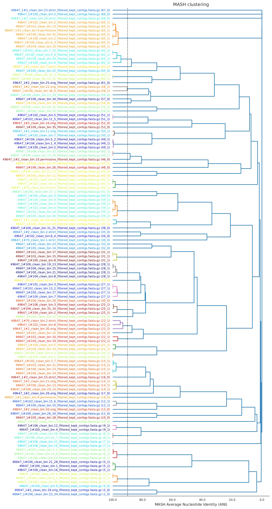
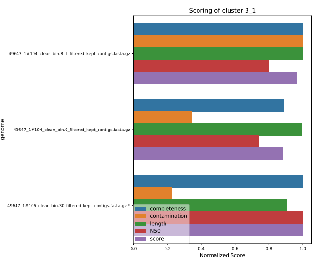

# Class 4: Functional and taxonomical annotation of MAGs

- - - -

## Taxonomical annotation of MAGs (GTDBtk)

Until this section of the workshop, the output are solemnly fasta sequences. Clean, filtered, and perfect fasta sequences that are collected in bins. Each of these bins represent, in theory, one species.

The following steps towards the interpretation of this information is the annotation. Particularly, the taxonomical annotation to have an overall idea of which bacteria is presented in the analyzed microbiome. This is strongly relevant for the analysis as knowing the microbial profile is one of the ultimate goals of this workshop.

To perform this taxonomical annotation, multiple tools are available. For instance, [PhyloPhlAn](https://github.com/biobakery/phylophlan) and [MiGA](https://github.com/bio-miga/miga) (Microbial Genome Atlas) are based on the NCBI taxonomy database and have been widely used. More compherensive tools, such as the Genome Taxonomy Database toolkit (GTDB-tk) employ the GTDB for identification.

Commonly, the taxonomic annotation is performed based on the aligments of the marker genes, such as the 16S rRNA gene, or aligment of database to the input bins. However, this is labour intensive and computational demanding. Therefore, other approach like the analysis based on statistics like percentage identity or Average Nucleotide Identity (ANI) have been implemented.

The GTDB-tk performs the taxonomic classification by placing bins into protein referecnes tree that are domain-specific and uses the criteria from Relative Evolutionary Divergence and ANI statistics.

For this, the toolkit uses the reference trees, alignments, and taxonomies available in the GTDB website. To make the initial placement, the toolkit identifies the genes using Prodigal and selects marker genes using HMMER. The input genomes are assigned to those domain-specific trees based on the highest proportion of identifies genes. The genes are aligned and concatenated into a single files that is used for placement using pplacer [(Chaumeil et al. 2020)](https://academic.oup.com/bioinformatics/article/36/6/1925/5626182?login=false).

Then, through the placements, RED and ANI values a taxonomy is assigned. RED values are used to resolve when rank assignments are ambiguous. Meanwhile, species are determined usinf the ANI values calculated based on the FastANI software. The criteria for genus is >65% and the species indicator is 95%. If these parameters are not met, the bins is classified as a novel genus or species, respectively [(Chaumeil et al. 2020)](https://academic.oup.com/bioinformatics/article/36/6/1925/5626182?login=false).

Overall, GTDB-tk is currently widely used for taxonomic annotation as the GTDB has gained popularity in the metagenomics research community. The workshop employs the second version of the software (GTDB-tk v2). This is very similar to the previous version. The main difference relays on the division of reference tree into class-level trees rather than domain-specific. This allows a more memory efficient approach for the taxonomy assignation process, as the GTDB has significantly grown in the last years [(Chaumeil et al. 2022)](https://academic.oup.com/bioinformatics/article/38/23/5315/6758240).

### Running gtdbtk

GTDB-tk is installed through a singularity container. The software presents multiple options as it represents a toolkit.

```bash
(base) [dorian.rojas@accessnode test]$ /opt/ohpc/pub/containers/BIO/gtdbtk-2.4.0.sif gtdbtk -h

              ...::: GTDB-Tk v2.4.0 :::...

  Workflows:
    classify_wf -> Classify genomes by placement in GTDB reference tree
                     (ani_screening -> identify -> align -> classify)
    de_novo_wf  -> Infer de novo tree and decorate with GTDB taxonomy
                     (identify -> align -> infer -> root -> decorate)

  Methods:
    identify -> Identify marker genes in genome
    align    -> Create multiple sequence alignment
    classify -> Determine taxonomic classification of genomes
    infer    -> Infer tree from multiple sequence alignment
    root     -> Root tree using an outgroup
    decorate -> Decorate tree with GTDB taxonomy

  Tools:
    infer_ranks        -> Establish taxonomic ranks of internal nodes using RED
    ani_rep            -> Calculates ANI to GTDB representative genomes
    trim_msa           -> Trim an untrimmed MSA file based on a mask
    export_msa         -> Export the untrimmed archaeal or bacterial MSA file
    remove_labels      -> Remove labels (bootstrap values, node labels) from an Newick tree
    convert_to_itol    -> Convert a GTDB-Tk Newick tree to an iTOL tree
    convert_to_species -> Convert GTDB genome IDs to GTDB species names


  Testing:
    test          -> Validate the classify_wf pipeline with 3 archaeal genomes
    check_install -> Verify third party programs and GTDB reference package

  Use: gtdbtk <command> -h for command specific help
```

Similar to CheckM, this toolkit have integrated complete workflows that involves several of the methods of the tools. In this regard, the `classify_wf` options is the required for the taxonomical annotation of the bins.

This module includes the `identify`, `align`, and `classify` modules of the complete toolkit. The `identify` module predicts the marker genes using Prodigal based on the 11 translation table. Moreover, the `align` module creates the multiple sequence aligment for the placement of the bins into the class-level trees. The marker genes used for this alignment are the AR53/BAC120 genes. Finaly, the `classify` module determines the taxonomic classification of the metagenomics bins.

```bash
(base) [dorian.rojas@accessnode test]$ /opt/ohpc/pub/containers/BIO/gtdbtk-2.4.0.sif gtdbtk classify_wf -h
usage: gtdbtk classify_wf (--genome_dir GENOME_DIR | --batchfile BATCHFILE) --out_dir OUT_DIR
                          (--skip_ani_screen | --mash_db MASH_DB) [--no_mash] [--mash_k MASH_K]
                          [--mash_s MASH_S] [--mash_v MASH_V] [--mash_max_distance MASH_MAX_DISTANCE] [-f]
                          [-x EXTENSION] [--min_perc_aa MIN_PERC_AA] [--prefix PREFIX] [--genes]
                          [--cpus CPUS] [--pplacer_cpus PPLACER_CPUS] [--force]
                          [--scratch_dir SCRATCH_DIR] [--write_single_copy_genes] [--keep_intermediates]
                          [--min_af MIN_AF] [--tmpdir TMPDIR] [--debug] [-h]

mutually exclusive required arguments:
  --genome_dir GENOME_DIR
                        directory containing genome files in FASTA format
  --batchfile BATCHFILE
                        path to file describing genomes - tab separated in 2 or 3 columns (FASTA file,
                        genome ID, translation table [optional])

required named arguments:
  --out_dir OUT_DIR     directory to output files

mutually exclusive required arguments:
  --skip_ani_screen     Skip the ani_screening step to classify genomes using mash and skani. (default:
                        False)
  --mash_db MASH_DB     path to save/read (if exists) the Mash reference sketch database (.msh)

optional Mash arguments:
  --no_mash             skip pre-filtering of genomes using Mash (default: False)
  --mash_k MASH_K       k-mer size [1-32] (default: 16)
  --mash_s MASH_S       maximum number of non-redundant hashes (default: 5000)
  --mash_v MASH_V       maximum p-value to keep [0-1] (default: 1.0)
  --mash_max_distance MASH_MAX_DISTANCE
                        Maximum Mash distance to select a potential GTDB genome as representative of a
                        user genome. (default: 0.15)

optional arguments:
  -f, --full_tree       use the unsplit bacterial tree for the classify step; this is the original GTDB-Tk
                        approach (version < 2) and requires more than 320 GB of RAM to load the reference
                        tree (default: False)
  -x, --extension EXTENSION
                        extension of files to process, gz = gzipped (default: fna)
  --min_perc_aa MIN_PERC_AA
                        exclude genomes that do not have at least this percentage of AA in the MSA
                        (inclusive bound) (default: 10)
  --prefix PREFIX       prefix for all output files (default: gtdbtk)
  --genes               indicates input files contain predicted proteins as amino acids (skip gene
                        calling).Warning: This flag will skip the ANI comparison steps (ani_screen and
                        classification). (default: False)
  --cpus CPUS           number of CPUs to use (default: 1)
  --pplacer_cpus PPLACER_CPUS
                        number of CPUs to use during pplacer placement
  --force               continue processing if an error occurs on a single genome (default: False)
  --scratch_dir SCRATCH_DIR
                        reduce pplacer memory usage by writing to disk (slower).
  --write_single_copy_genes
                        output unaligned single-copy marker genes (default: False)
  --keep_intermediates  keep intermediate files in the final directory (default: False)
  --min_af MIN_AF       minimum alignment fraction to assign genome to a species cluster (default: 0.5)
  --tmpdir TMPDIR       specify alternative directory for temporary files (default: /tmp)
  --debug               create intermediate files for debugging purposes (default: False)
  -h, --help            show help message
```

Code for the `classify_wf` workflow for the indicating the batch file created with the python script as the input and a novel `11-gtdbtk` as the outpur directory. Notice the default extension of the software is `.fna`. Therefore, set the extension to `.gz` using the `-x` flag. In this case, threats are specified using the `--cpus` option. Also, due to the time consuming nature of the process, add the `-skip_ani_screen` function.

The database for the gtdbtk must be indicated by adding `export GTDBTK_DATA_PATH="/home/public/met-workshop/databases/release220/"` prior the tool command. `export` is a base command that sets an environmental variable. Most variables are different depending on the running software; therefore, this information has to be retrieved from the source code or the github repository.

This analysis needs to be run only once in the batch file. As the input is not divided by the samples and the batch file includes samples from all the bins. This allows the `.slurm` to be slightly different. For instance, the `for` loop can be removed from the command the output is set to the general directory, avoiding the creation of sample-specific subfolders.

Finally, the `.slurm` file is indicated using the `sbatch` command in the console. The `batch.sh` is not required.

> If the job takes a while running, the results in the common repository `/home/public/met-workshop`

Evaluate the results folder.

```bash
(base) [dorian.rojas@accessnode test]$ ls 11-gtdbtk/
align  classify  gtdbtk.bac120.summary.tsv  gtdbtk.json  gtdbtk.log  gtdbtk.warnings.log  identify
```

There are individuals folders with the results for each GTDB-tk module. The `gtdbtk.bac120.summary.tsv` contains the information regarding the taxonomic classification for the respective marker gene. This tab-separared table is divides in several columns.

```vim
user_genome     classification  closest_genome_reference        closest_genome_reference_radius closest_genome_taxonomy     closest_genome_ani      closest_genome_af       closest_placement_reference     closest_placement_radius    closest_placement_taxonomy      closest_placement_ani   closest_placement_af    pplacer_taxonomy    classification_method   note    other_related_references(genome_id,species_name,radius,ANI,AF)  msa_percent translation_table       red_value       warnings
SRR8555091_bin.1.permissive     d__Bacteria;p__Spirochaetota;c__Spirochaetia;o__Treponematales;f__Treponemataceae;g__Treponema_D;s__Treponema_D sp900541945 GCA_022010055.1 95.0    d__Bacteria;p__Spirochaetota;c__Spirochaetia;o__Treponematales;f__Treponemataceae;g__Treponema_D;s__Treponema_D sp900541945 98.12   0.752   GCA_022010055.1     95.0    d__Bacteria;p__Spirochaetota;c__Spirochaetia;o__Treponematales;f__Treponemataceae;g__Treponema_D;s__Treponema_D sp900541945 98.12   0.752   d__Bacteria;p__Spirochaetota;c__Spirochaetia;o__Treponematales;f__Treponemataceae;g__Treponema_D;s__        taxonomic classification defined by topology and ANItopological placement and ANI have congruent species assignments        GCA_900317625.1, s__Treponema_D sp900317625, 95.0, 85.39, 0.268; GCA_002478955.1, s__Treponema_D sp002478955, 95.0, 85.14, 0.279; GCA_934718065.1, s__Treponema_D sp934718065, 95.0, 84.66, 0.211       79.66   11      N/A     N/A
SRR8555091_bin.2.strict d__Bacteria;p__Bacteroidota;c__Bacteroidia;o__Bacteroidales;f__UBA932;g__Cryptobacteroides;s__Cryptobacteroides sp000434935 GCA_000434935.1 95.0    d__Bacteria;p__Bacteroidota;c__Bacteroidia;o__Bacteroidales;f__UBA932;g__Cryptobacteroides;s__Cryptobacteroides sp000434935 96.83   0.773   GCA_000434935.1     95.0    d__Bacteria;p__Bacteroidota;c__Bacteroidia;o__Bacteroidales;f__UBA932;g__Cryptobacteroides;s__Cryptobacteroides sp000434935 96.83   0.773   d__Bacteria;p__Bacteroidota;c__Bacteroidia;o__Bacteroidales;f__UBA932;g__Cryptobacteroides;s__      taxonomic classification defined by topology and ANI    topological placement and ANI have congruent species assignments    N/A     72.67   11      N/A     N/A
SRR9988205_bin.1.permissive     d__Bacteria;p__Pseudomonadota;c__Gammaproteobacteria;o__Enterobacterales;f__Enterobacteriaceae;g__Escherichia;s__Escherichia coli   GCF_003697165.2 95.0    d__Bacteria;p__Pseudomonadota;c__Gammaproteobacteria;o__Enterobacterales;f__Enterobacteriaceae;g__Escherichia;s__Escherichia coli   98.39       0.921   GCF_003697165.2 95.0    d__Bacteria;p__Pseudomonadota;c__Gammaproteobacteria;o__Enterobacterales;f__Enterobacteriaceae;g__Escherichia;s__Escherichia coli   98.39   0.921   d__Bacteria;p__Pseudomonadota;c__Gammaproteobacteria;o__Enterobacterales;f__Enterobacteriaceae;g__Escherichia;s__   taxonomic classification defined by topology and ANI        topological placement and ANI have congruent species assignments   GCF_000194175.1, s__Escherichia coli_F, 95.0, 95.66, 0.841; GCF_002965065.1, s__Escherichia sp002965065, 95.0, 94.29, 0.69; GCF_004211955.1, s__Escherichia sp004211955, 95.0, 93.15, 0.728; GCF_005843885.1, s__Escherichia sp005843885, 95.0, 92.99, 0.746; GCF_029876145.1, s__Escherichia ruysiae, 95.0, 92.88, 0.744; GCF_000026225.1, s__Escherichia fergusonii, 95.0, 92.75, 0.565; GCF_011881725.1, s__Escherichia coli_E, 95.0, 92.4, 0.713; GCF_014836715.1, s__Escherichia whittamii, 95.0, 92.08, 0.741; GCF_002900365.1, s__Escherichia marmotae, 95.0, 91.17, 0.711; GCF_000759775.1, s__Escherichia albertii, 95.0, 90.64, 0.611      86.0    11      N/AN/A
SRR9988205_bin.2.permissive     d__Bacteria;p__Bacteroidota;c__Bacteroidia;o__Bacteroidales;f__Bacteroidaceae;g__Bacteroides;s__Bacteroides fragilis        GCF_000025985.1 95.0    d__Bacteria;p__Bacteroidota;c__Bacteroidia;o__Bacteroidales;f__Bacteroidaceae;g__Bacteroides;s__Bacteroides fragilis        99.01   0.901   GCF_000025985.1     95.0    d__Bacteria;p__Bacteroidota;c__Bacteroidia;o__Bacteroidales;f__Bacteroidaceae;g__Bacteroides;s__Bacteroides fragilis        99.01   0.901   d__Bacteria;p__Bacteroidota;c__Bacteroidia;o__Bacteroidales;f__Bacteroidaceae;g__Bacteroides;s__    taxonomic classification defined by topology and ANI    topological placement and ANI have congruent species assignments    GCA_947646015.1, s__Bacteroides sp947646015, 95.0, 97.98, 0.349; GCF_019583405.1, s__Bacteroides fragilis_B, 95.0, 91.9, 0.692; GCF_014288095.1, s__Bacteroides hominis, 95.0, 88.11, 0.582     90.21   11      N/A     N/A
(base) [dorian.rojas@accessnode test]$
```

The results here showed the classification for all the four analyzed bins. Two of these were identified to the species level (*Escherichia coli* and *Bacteroides fragilis*), while the other remained as genera (*Treponema* sp. and *Cryptobacteroides* sp.).

These results provide a taxonomical interpretation to the sequences. However, further analysis is still required. For instance, the abundance estimation, sequencing depth, metabolic potential, and other clinical aspects (Antibiotics Resistance Genes, Mobile Genentic Elements) can still be analyzed.

Prior to these, the dereplication of the MAGs can be performed.

## MAGs dereplication (dRep)

MAGs dereplication is an optional process in the metagenomics pipeline analysis. This part of the workshop is going to be demonstrative as the dereplication process can't be correctly performed in the working dataset.

Dereplication consists in analyzing the bins to remove all those sequences that have high similarity among them. These similarities are calculated based on different methods; for instance, ANI values. As mentioned above, this step is optional and in some cases it is skipped to further obtained the desired results (e.g. strain-level studies).

This is performed in order to deal with computational demanding analysis, diversity issues (various genomes from the same species), and unspecific mapping while determining abundance and sequencing depth. The final output is a list of so called representative genomes.

There are several tools that can be used to performed the dereplication process. However, the most widely used is [dRep](https://github.com/MrOlm/drep). dRep employs a bi-phasic approach to deprelicate genomes by using gANI and Mash software. gANI is a very efficient method for dereplication; however, it would take a long time to analyze large genome sets. Moreover, Mash is time-efficient, but compromises the accuracy of the dereplication when completeness decreases [(Olm et al. 2017)](https://academic.oup.com/ismej/article/11/12/2864/7537826).

In this sense, the bi-phasic approach first divides genomes into clusters using Mash. Then, these are compaired in a pairwise manner using gANI generating secondary clusters of near-identical genomes that are dereplicated [(Olm et al. 2017)](https://academic.oup.com/ismej/article/11/12/2864/7537826).

> Notice this approach does not considers the taxonomical classification of the bins and it is merely based on statistics. This allows the analysis to be performed either before or after the taxonomical assigment with GTDB-tk.

Here, a basic dereplication process for an example dataset of bins is conducted.

### Running dRep

dRep is installed as a container. The first help message is a menu to select the compare or dereplicate functions of the tools. In this case, the dereplication is our option of interest.

```bash
(base) [dorian.rojas@accessnode test]$ /opt/ohpc/pub/containers/BIO/drep-3.5.0.sif dRep -h

                ...::: dRep v3.5.0 :::...

  Matt Olm. MIT License. Banfield Lab, UC Berkeley. 2017 (last updated 2024)

  See https://drep.readthedocs.io/en/latest/index.html for documentation
  Choose one of the operations below for more detailed help.

  Example: dRep dereplicate -h

  Commands:
    compare            -> Compare and cluster a set of genomes
    dereplicate        -> De-replicate a set of genomes
    check_dependencies -> Check which dependencies are properly installed


(base) [dorian.rojas@accessnode test]$ /opt/ohpc/pub/containers/BIO/drep-3.5.0.sif dRep dereplicate -h
usage: dRep dereplicate [-p PROCESSORS] [-d] [-h] [-g [GENOMES ...]] [-l LENGTH] [-comp COMPLETENESS]
                        [-con CONTAMINATION] [--ignoreGenomeQuality] [--genomeInfo GENOMEINFO]
                        [--checkM_method {lineage_wf,taxonomy_wf}] [--set_recursion SET_RECURSION]
                        [--checkm_group_size CHECKM_GROUP_SIZE]
                        [--S_algorithm {ANIn,goANI,fastANI,skani,ANImf,gANI}] [-ms MASH_SKETCH]
                        [--SkipMash] [--SkipSecondary] [--skani_extra SKANI_EXTRA]
                        [--n_PRESET {normal,tight}] [-pa P_ANI] [-sa S_ANI] [-nc COV_THRESH]
                        [-cm {total,larger}]
                        [--clusterAlg {complete,single,average,ward,centroid,median,weighted}]
                        [--multiround_primary_clustering] [--primary_chunksize PRIMARY_CHUNKSIZE]
                        [--greedy_secondary_clustering] [--run_tertiary_clustering]
                        [-comW COMPLETENESS_WEIGHT] [-conW CONTAMINATION_WEIGHT]
                        [-strW STRAIN_HETEROGENEITY_WEIGHT] [-N50W N50_WEIGHT] [-sizeW SIZE_WEIGHT]
                        [-centW CENTRALITY_WEIGHT] [-extraW EXTRA_WEIGHT_TABLE] [--gen_warnings]
                        [--warn_dist WARN_DIST] [--warn_sim WARN_SIM] [--warn_aln WARN_ALN] [--skip_plots]
                        work_directory

positional arguments:
  work_directory        Directory where data and output are stored
                        *** USE THE SAME WORK DIRECTORY FOR ALL DREP OPERATIONS ***

SYSTEM PARAMETERS:
  -p PROCESSORS, --processors PROCESSORS
                        threads (default: 6)
  -d, --debug           make extra debugging output (default: False)
  -h, --help            show this help message and exit

GENOME INPUT:
  -g [GENOMES ...], --genomes [GENOMES ...]
                        genomes to filter in .fasta format. Not necessary if Bdb or Wdb already exist. Can
                        also input a text file with paths to genomes, which results in fewer OS issues
                        than wildcard expansion (default: None)

GENOME FILTERING OPTIONS:
  -l LENGTH, --length LENGTH
                        Minimum genome length (default: 50000)
  -comp COMPLETENESS, --completeness COMPLETENESS
                        Minimum genome completeness (default: 75)
  -con CONTAMINATION, --contamination CONTAMINATION
                        Maximum genome contamination (default: 25)

GENOME QUALITY ASSESSMENT OPTIONS:
  --ignoreGenomeQuality
                        Dont run checkM or do any quality filtering. NOT RECOMMENDED! This is useful for
                        use with bacteriophages or eukaryotes or things where checkM scoring does not
                        work. Will only choose genomes based on length and N50 (default: False)
  --genomeInfo GENOMEINFO
                        location of .csv file containing quality information on the genomes. Must contain:
                        ["genome"(basename of .fasta file of that genome), "completeness"(0-100 value for
                        completeness of the genome), "contamination"(0-100 value of the contamination of
                        the genome)] (default: None)
  --checkM_method {lineage_wf,taxonomy_wf}
                        Either lineage_wf (more accurate) or taxonomy_wf (faster) (default: lineage_wf)
  --set_recursion SET_RECURSION
                        Increases the python recursion limit. NOT RECOMMENDED unless checkM is crashing
                        due to recursion issues. Recommended to set to 2000 if needed, but setting this
                        could crash python (default: 0)
  --checkm_group_size CHECKM_GROUP_SIZE
                        The number of genomes passed to checkM at a time. Increasing this increases RAM
                        but makes checkM faster (default: 2000)

GENOME COMPARISON OPTIONS:
  --S_algorithm {ANIn,goANI,fastANI,skani,ANImf,gANI}
                        Algorithm for secondary clustering comaprisons:
                        fastANI = Kmer-based approach; very fast
                        skani = Even faster Kmer-based approacht
                        ANImf   = (DEFAULT) Align whole genomes with nucmer; filter alignment; compare aligned regions
                        ANIn    = Align whole genomes with nucmer; compare aligned regions
                        gANI    = Identify and align ORFs; compare aligned ORFS
                        goANI   = Open source version of gANI; requires nsmimscan
                         (default: fastANI)
  -ms MASH_SKETCH, --MASH_sketch MASH_SKETCH
                        MASH sketch size (default: 1000)
  --SkipMash            Skip MASH clustering, just do secondary clustering on all genomes (default: False)
  --SkipSecondary       Skip secondary clustering, just perform MASH clustering (default: False)
  --skani_extra SKANI_EXTRA
                        Extra arguments to pass to skani triangle (default: )
  --n_PRESET {normal,tight}
                        Presets to pass to nucmer
                        tight   = only align highly conserved regions
                        normal  = default ANIn parameters (default: normal)

GENOME CLUSTERING OPTIONS:
  -pa P_ANI, --P_ani P_ANI
                        ANI threshold to form primary (MASH) clusters (default: 0.9)
  -sa S_ANI, --S_ani S_ANI
                        ANI threshold to form secondary clusters (default: 0.95)
  -nc COV_THRESH, --cov_thresh COV_THRESH
                        Minmum level of overlap between genomes when doing secondary comparisons (default:
                        0.1)
  -cm {total,larger}, --coverage_method {total,larger}
                        Method to calculate coverage of an alignment
                        (for ANIn/ANImf only; gANI and fastANI can only do larger method)
                        total   = 2*(aligned length) / (sum of total genome lengths)
                        larger  = max((aligned length / genome 1), (aligned_length / genome2))
                         (default: larger)
  --clusterAlg {complete,single,average,ward,centroid,median,weighted}
                        Algorithm used to cluster genomes (passed to scipy.cluster.hierarchy.linkage
                        (default: average)

GREEDY CLUSTERING OPTIONS
These decrease RAM use and runtime at the expense of a minor loss in accuracy.
Recommended when clustering 5000+ genomes:
  --multiround_primary_clustering
                        Cluster each primary clunk separately and merge at the end with single linkage.
                        Decreases RAM usage and increases speed, and the cost of a minor loss in precision
                        and the inability to plot primary_clustering_dendrograms. Especially helpful when
                        clustering 5000+ genomes. Will be done with single linkage clustering (default:
                        False)
  --primary_chunksize PRIMARY_CHUNKSIZE
                        Impacts multiround_primary_clustering. If you have more than this many genomes,
                        process them in chunks of this size. (default: 5000)
  --greedy_secondary_clustering
                        Use a heuristic to avoid pair-wise comparisons when doing secondary clustering.
                        Will be done with single linkage clustering. Only works for fastANI S_algorithm
                        option at the moment (default: False)
  --run_tertiary_clustering
                        Run an additional round of clustering on the final genome set. This is especially
                        useful when greedy clustering is performed and/or to handle cases where similar
                        genomes end up in different primary clusters. Only works with dereplicate, not
                        compare. (default: False)

SCORING CRITERIA
Based off of the formula:
A*Completeness - B*Contamination + C*(Contamination * (strain_heterogeneity/100)) + D*log(N50) + E*log(size) + F*(centrality - S_ani)

A = completeness_weight; B = contamination_weight; C = strain_heterogeneity_weight; D = N50_weight; E = size_weight; F = cent_weight:
  -comW COMPLETENESS_WEIGHT, --completeness_weight COMPLETENESS_WEIGHT
                        completeness weight (default: 1)
  -conW CONTAMINATION_WEIGHT, --contamination_weight CONTAMINATION_WEIGHT
                        contamination weight (default: 5)
  -strW STRAIN_HETEROGENEITY_WEIGHT, --strain_heterogeneity_weight STRAIN_HETEROGENEITY_WEIGHT
                        strain heterogeneity weight (default: 1)
  -N50W N50_WEIGHT, --N50_weight N50_WEIGHT
                        weight of log(genome N50) (default: 0.5)
  -sizeW SIZE_WEIGHT, --size_weight SIZE_WEIGHT
                        weight of log(genome size) (default: 0)
  -centW CENTRALITY_WEIGHT, --centrality_weight CENTRALITY_WEIGHT
                        Weight of (centrality - S_ani) (default: 1)
  -extraW EXTRA_WEIGHT_TABLE, --extra_weight_table EXTRA_WEIGHT_TABLE
                        Path to a tab-separated file with two-columns, no headers, listing genome and
                        extra score to apply to that genome (default: None)

WARNINGS:
  --gen_warnings        Generate warnings (default: False)
  --warn_dist WARN_DIST
                        How far from the threshold to throw cluster warnings (default: 0.25)
  --warn_sim WARN_SIM   Similarity threshold for warnings between dereplicated genomes (default: 0.98)
  --warn_aln WARN_ALN   Minimum aligned fraction for warnings between dereplicated genomes (ANIn)
                        (default: 0.25)

ANALYZE:
  --skip_plots          Dont make plots (default: False)

Example: dRep dereplicate output_dir/ -g /path/to/genomes/*.fasta
```

This software is very complete for different kind of analysis. Therefore, it contains a great quantity of functions that could be selected in the command. However, the main code is composed of the required flags `dRep dereplicate outout_directory -g path/to/genomes/*.fasta`.

The software requires the integration of CheckM data about completeness and contamination which could favor the accuracy of the process. This can be created through a simple python script.

> This code is an modified example provided by the M.Sc. Maria Alejandra Soto, a secondee from the project, for the demostrative purposes of the workshop.

```python
import glob
import pandas as pd
from tqdm.auto import tqdm
import re
import os
import shutil


# Extract list of genomes (MAGs)
ale_tax_classification = pd.read_csv('/home/dorian.rojas/1-test-alejandra/0-data/test_drep/mags_taxonomy_gtdb.csv')
ale_tax_classification['classification'] = ale_tax_classification[['domain','phylum','class','order','family','genus','species']].agg(';'.join, axis = 1)
ale_tax_classification['user_genome'] = ale_tax_classification['user_genome'] + '_filtered_kept_contigs.fasta.gz'
ale_for_drep = ale_tax_classification[['user_genome', 'classification']]

example_tax_classification = pd.read_csv('/home/dorian.rojas/1-test-alejandra/10-gtdbtk/gtdbtk.bac120.summary.tsv', delimiter='\t')
example_tax_classification['user_genome'] = example_tax_classification['user_genome'] + '_filtered_kept_contigs.fasta.gz'
example_for_drep = example_tax_classification[['user_genome', 'classification']]

# Saving as a new file in the drep folder
all_for_drep = pd.concat([example_for_drep, ale_for_drep], ignore_index=True)
all_for_drep.to_csv('/home/dorian.rojas/1-test-alejandra/11-dRep/for_drep.csv', index =False)

###################################### optional ###########################################
# Create a directory with the genomes files present in the previously generated list
directories_to_search = ['/home/dorian.rojas/1-test-alejandra/6-mdmcleaner/bins', '/home/dorian.rojas/1-test-alejandra/0-data/test_drep/data']

# Load the list of genomes to analize
for_drep = pd.read_csv('/home/dorian.rojas/1-test-alejandra/11-dRep/for_drep.csv')

# Create an output directory for the copied files
  # I copied the files for organization purposes (notice it was created in the 9-final-MAGs folder). However, it is also recommended in case not all files were created by your username (e.g. public databases), this avoids permission issues.
   # This script can be modified so it does not copy the files but instead only creates the .csv file.
output_directory = '/home/dorian.rojas/1-test-alejandra/9-final-MAGs/all_genomes'
os.makedirs(output_directory, exist_ok=True)

i = 0
# Iterate through the directories
for directory in directories_to_search:
    # Recursively walk through the directory and its subdirectories
    for root, dirs, files in os.walk(directory):
        for filename in files:
            if filename.endswith('_filtered_kept_contigs.fasta.gz'):
                # Check if the filename (with extension) is in the 'user_genome' column
                if filename in for_drep['user_genome'].values:
                    i += 1
                    print(f'File number {i} found: {filename}!')
                    filepath = os.path.join(root, filename)
                    # Copy the file to the output directory
                    shutil.copy(filepath, os.path.join(output_directory, filename))

# Create a CSV file with the paths of copied files
copied_files_df = pd.DataFrame({'file_path': [os.path.join(output_directory, f) for f in os.listdir(output_directory)]})
copied_files_df.to_csv('/home/dorian.rojas/1-test-alejandra/11-dRep/paths_genomes_for_drep.csv', index=False)


genomes_to_find = pd.read_csv('/home/dorian.rojas/1-test-alejandra/11-dRep/for_drep.csv')

# Changing column names for unification (genome, completness, contamination)
checkm_sample = pd.read_csv('/home/dorian.rojas/1-test-alejandra/9-final-MAGs/final_mags.tsv', sep = '\t')
checkm_sample['genome'] = checkm_sample['genome'].str.replace(r'_filtered_kept_contigs\.fasta$', '_filtered_kept_contigs.fasta.gz', regex=True)
checkm_sample = checkm_sample.rename(columns = {'genome':'user_genome'})
sample_checkm2_for_drep = checkm_sample[checkm_sample['user_genome'].isin(genomes_to_find['user_genome'])]

ale_checkm = pd.read_csv('/home/dorian.rojas/1-test-alejandra/0-data/test_drep/mags_checkm2.csv')
ale_checkm['genome'] = ale_checkm['genome'].str.replace(r'_filtered_kept_contigs\.fasta$', '_filtered_kept_contigs.fasta.gz', regex=True)
ale_checkm = ale_checkm.rename(columns = {'genome':'user_genome'})
ale_checkm_for_drep = ale_checkm[ale_checkm['user_genome'].isin(genomes_to_find['user_genome'])]

# Creating consolidated file with all the genomes and their quality metrics
all_checkm2_for_drep = pd.concat([ale_checkm_for_drep[['user_genome', 'Completeness', 'Contamination']], sample_checkm2_for_drep[['user_genome','Completeness','Contamination']]], ignore_index = True)

# Renaming columns to be identified by dRep
all_checkm2_for_drep = all_checkm2_for_drep.rename(columns = {'user_genome':'genome','Completeness':'completeness','Contamination':'contamination'})
all_checkm2_for_drep.to_csv('/home/dorian.rojas/1-test-alejandra/11-dRep/all_checkm2_for_drep.csv', index=False)
```

The final output are several files in the `11-dRep` folder. The `all_checkm2_for_drep.csv` and `paths_genomes_for_drep.csv` are the inputs for the dRep analysis, it contains the quality information from CheckM2 and the path to the `.fasta` files of each bin.

```bash
(base) [dorian.rojas@accessnode 1-test-alejandra]$ ls 11-dRep/
all_checkm2_for_drep.csv  for_drep.csv  paths_genomes_for_drep.csv

(base) [dorian.rojas@accessnode 1-test-alejandra]$ head 11-dRep/all_checkm2_for_drep.csv
genome,completeness,contamination
49647_1#102_clean_bin.12_filtered_kept_contigs.fasta.gz,65.76,0.53
49647_1#106_clean_bin.26_24_filtered_kept_contigs.fasta.gz,99.42,2.34
49647_1#102_clean_bin.11_filtered_kept_contigs.fasta.gz,84.66,3.82
49647_1#102_clean_bin.5_filtered_kept_contigs.fasta.gz,91.64,3.67
49647_1#100_clean_bin.5_filtered_kept_contigs.fasta.gz,99.43,0.35
49647_1#104_clean_bin.1_4_filtered_kept_contigs.fasta.gz,93.69,2.12
49647_1#106_clean_bin.10_33_filtered_kept_contigs.fasta.gz,96.18,0.18
49647_1#106_clean_bin.12_23_filtered_kept_contigs.fasta.gz,60.96,1.27
49647_1#102_clean_bin.3_filtered_kept_contigs.fasta.gz,98.84,0.24
```

Finally, the `drep.slurm` file can be completed. For this analysis we stabilish various flags. These include: `-g` to indicate the path files, `-p` for the threats, `-comp` for minimum completeness of 50, `-con` for maximum contamination of 5, `--S_ani` for 0.95 ANI threshold, `--cov_thresh` for 0.30 coverage threshold, `--S_algorithm` for ANI algorithm to use, and the `--genomeInfo` for the CheckM2 information.

> Notice the `--S_algorithm` selects the fastANI approach althought the ideal of dRep is the use of gANI. However, the fastANI is faster and works best for the demonstrative purpose of the workshop.

Similarly to the GTDB-tk code, this ignores the `batch.sh` file and the `for` loop and it is sent directly with all the samples in the `paths_genomes_for_drep.csv` file using `sbatch drep.slurm`. The final example of the slurm file used to run the code for dereplication is presented below.

```vim
#!/bin/bash
#SBATCH --partition=parallel
#SBATCH --account=parallel-24h
#SBATCH --time=24:00:00
#SBATCH --nodes=1
#SBATCH --ntasks-per-node=64
#SBATCH --job-name="drep"
#SBATCH -o zz-%x-%j.o
#SBATCH -e zz-%x-%j.e
#SBATCH --mail-user=dorian.rojas@ucr.ac.cr
#SBATCH --mail-type=END,FAIL

cd /home/dorian.rojas/1-test-alejandra

CTN_PATH=/opt/ohpc/pub/containers/BIO/
$CTN_PATH/drep-3.5.0.sif dRep --version

mkdir -p 11-dRep/

$CTN_PATH/drep-3.5.0.sif dRep dereplicate ./11-dRep -g  11-dRep/paths_genomes_for_drep.csv \
        -p $SLURM_NTASKS -comp 50 -con 5 --genomeInfo 11-dRep/all_checkm2_for_drep.csv \
        --S_ani 0.95 --cov_thresh 0.30 --S_algorithm fastANI

date
time
```

The output from the dRep analysis are several files and folders within the output folder.

```bash
(base) [dorian.rojas@accessnode 1-test-alejandra]$ ls 11-dRep/
all_checkm2_for_drep.csv  data_tables           figures       log
data                      dereplicated_genomes  for_drep.csv  paths_genomes_for_drep.csv
```

Notice the `.csv` file were created by the python script. Hence, the output files from dRep are within the new folders.

The folder figures contain different images in `.pdf` format that favor the understand of the similarity relationship between the analyzed genomes. These correspond, for example, to the dendogram of the primary and secondary cluster. Below the example fo the dendrogram of the primary clusterng is presented, the dotted line represents the ANI threshold of 0.95,



Analyze the rest of the images and try to understand thei relevance for the analysis. In addition, an image representing the quality score of the cluster is presented with the selected (representative) genome marked with an *. This graph is presented in the `Cluster_scoring.pdf` file. This allows the user to easily identify that dRep selected the best genome



Moreover, the `data_tables` folders contains the information generated to select the representatives genomes. The `log` folder contains the log files. The `data` folder includes the data greated during the workflo2 (e.g. ANI values). Finally, the `dereplicated_genomes` holds the sequences files of the representative genomes.

```bash
(base) [dorian.rojas@accessnode 11-dRep]$ ls data_tables/
Bdb.csv  Cdb.csv  genomeInfo.csv  genomeInformation.csv  Mdb.csv  Ndb.csv  Sdb.csv  Wdb.csv  Widb.csv

(base) [dorian.rojas@accessnode 11-dRep]$ ls log/
cluster_arguments.json  logger.log

(base) [dorian.rojas@accessnode 11-dRep]$ ls dereplicated_genomes/
49647_1#100_clean_bin.11_filtered_kept_contigs.fasta.gz
49647_1#100_clean_bin.14_filtered_kept_contigs.fasta.gz
49647_1#100_clean_bin.18_filtered_kept_contigs.fasta.gz
49647_1#100_clean_bin.1_filtered_kept_contigs.fasta.gz
[...]
```

The final results from this `dereplicated_genomes` are the one used for the abundance estimation and functional annotation.

As previously mentioned, this part of the workshop is demonstrative as the datasets does not allow to perform dereplciation (due to the presence of only a few bins that do not require dereplication). Therefore, the following section will continue to be performed with the working samples.

## Functional annotation of MAGs (ABRicate, eggNOG-mapper)

Further analysis is performed using a pangenome. A pangenome is a file with multiple sequences representing the genomes from the sample. Basically, it is a concatenation of the bins into a singular file. Although, the individual files can be used in the analysis, the utilization of a pangenome could avoid several coding issues, faciliting the overall pipeline. This pangenome can be created through different approaches. Here, the provide a simple bash code using the command `cat`.

>Notice the following sections of the workshop are hands-on. Remember where are your files of interest located in your console.

```bash
#!/bin/bash

cd /home/dorian.rojas/test
CTN_PATH=/opt/ohpc/pub/containers/BIO/

# Create a general directpry
mkdir -p 10-final-MAGs/bins

# Select each of the bins that passed the GUNC analysis
for file_name in $(awk '{print $2}' 10-final-MAGs/gtdb-input.txt); do
        # Create a variable for the name of the (de)compressed bins
        compressed="${file_name}_filtered_kept_contigs.fasta.gz"
        newname="${file_name}_filtered_kept_contigs.fasta"

        # Decompress the bins
        gzip -dc 7-mdmcleaner/bins/$compressed > 7-mdmcleaner/bins/$newname

        # Rename the contigs using the bbmap toolkit and output in general directory
        $CTN_PATH/bbmap-39.10.sif rename.sh in=7-mdmcleaner/bins/$newname \
        out=10-final-MAGs/bins/$newname prefix=$file_name
done

# Concatenate decompressed renamed files
cat 10-final-MAGs/bins/*.fasta > 10-final-MAGs/bins/pangenome.fasta
```

Copy the code into a `pangenome.sh` file. Ensure to change the path where the data is located. This script will decompress the `.fasta.gz` files and rename each contigs with the sample name. This step is crucial as `cat` will combine all contigs regardless of the their names. For this, the toolkit BBMap and module `rename.sh` are used. Finally, all the decompressed renamed files are combined into a single pangenome fasta.

This final file can be use to facilitate the command of other analysis. During this workshop, the functional annotation of clinical features and metabolic pathways are going to be performed. First the annotation of clinical features refers to the identification of genomic characteristics that can be associated to a clinical risk. In this regard, mobile genetic elements and antibiotic resistance genes can be of interest.

Several tools have been developed for this approach. For instance, the Comprehensive Antibiotic Resistance Database (CARD) developed the [Resistance Gene Identifer](https://github.com/arpcard/rgi) (RGI) that allows the annotation against this database. Moreover, the [AMRFinderPlus](https://github.com/ncbi/amr) performs a similar tasks againt the National Center for Biotechnology Information (NCBI) database. The large quantity of databases for antibiotic resistance genes and other features resulted in the need of a more general software that could conduct the identification against multiple databases. As a solution to this issue, ABRicate was proposed.

[ABRicate](https://github.com/tseemann/abricate/tree/master) is a complete tool to perform the annotation of different features taking in consideration multiple databases. Among the predetermine reference, the NCBI, CARD, Resfinder, ARG-ANNOT, MEGARES, EcOH, PlasmidFinder, VFDB, and Ecoli_VF are included. The tools also allows the user to create they custom databases for more specific analysis. To perform the annotation, ABRicate employs the BLAST+ software.

> The authors defined the etymology as "Anti-Biotic Resistance" in the form of an English verb to represent the software taking action against the antibiotic resistance. They also stated that "[it] is unlikely to receive an infamous [JABBA AWARD](http://www.acgt.me/blog/2014/12/1/time-for-a-new-jabba-award-for-just-another-bogus-bioinformatics-acronym) (Just Another Bogus Bioinformatics Acronym Award).

Moreover, another interesting feature to analyze in the microbiome is the potential metabolic processes encoded in the identified bacteria. These are considered 'potential' as the genomic data can not ensure that these are being expressed.

Similarly to the clinical feature, a vast variety of tools with different methodologies have been developed to perform metabolic annotations. For instance, the software [HUMAnN](https://github.com/biobakery/humann) (HMP Unified Metabolic Analysis Network) has been widely used in this regard. This is an efficient tools for profiling the abundace of microbial metabolic pathways and other molecular functions from metagenomics or metatranscriptomics data.

During this workshop, the software [eggNOG-mapper](https://github.com/eggnogdb/eggnog-mapper/wiki/eggNOG-mapper-v2.1.5-to-v2.1.12#user-content-Basic_usage) will be used. This software performs annotation based on its own database of precomputed orthologous groups (OG) and phylogenies. Such approach, avoids biases based on taxonomic profiling. For this, fasta files are translated into protens using Prodigal and the output is aligned to the eggNOG database using either HMMER3, DIAMOND, or MMseqs2. The orthology is infered based on the selected taxonomy (eukaryota, bacteria, archaea, virus) and finally OGs are annotated based on different databases (e.g. GeneOntology, Pfam, KEGG...).

>Interestingly, eggNOG-mapper seems to have a higher annotation rate in comparison to HUMAnN, as it allows the identification based on OGs instead of species identification [(Mi et al. 2024)](https://www.sciencedirect.com/science/article/pii/S2667237524003229). This allows the inclusion of novel, uncultured, poorly represented species, among others.

### Running abricate

This software is installed as a container and is simple to use. The only issue is that in order run multiple databases at the same time, a bash `for` loop must be used as the toolf does not accept various databases simultaneously.

>Please ignore a perl error if it appears. This should not affect the pipeline.

```bash
(base) [dorian.rojas@accessnode 1-test-alejandra]$ /opt/ohpc/pub/containers/BIO/abricate-1.0.1.sif abricate -h
SYNOPSIS
  Find and collate amplicons in assembled contigs
AUTHOR
  Torsten Seemann (@torstenseemann)
USAGE
  % abricate --list
  % abricate [options] <contigs.{fasta,gbk,embl}[.gz] ...> > out.tab
  % abricate [options] --fofn fileOfFilenames.txt > out.tab
  % abricate --summary <out1.tab> <out2.tab> <out3.tab> ... > summary.tab
GENERAL
  --help          This help.
  --debug         Verbose debug output.
  --quiet         Quiet mode, no stderr output.
  --version       Print version and exit.
  --check         Check dependencies are installed.
  --threads [N]   Use this many BLAST+ threads [1].
  --fofn [X]      Run on files listed in this file [].
DATABASES
  --setupdb       Format all the BLAST databases.
  --list          List included databases.
  --datadir [X]   Databases folder [/usr/local/db].
  --db [X]        Database to use [ncbi].
OUTPUT
  --noheader      Suppress column header row.
  --csv           Output CSV instead of TSV.
  --nopath        Strip filename paths from FILE column.
FILTERING
  --minid [n.n]   Minimum DNA %identity [80].
  --mincov [n.n]  Minimum DNA %coverage [80].
MODE
  --summary       Summarize multiple reports into a table.
DOCUMENTATION
  https://github.com/tseemann/abricate
```

The available databases to be used with abricate can be explored with the `--list` command.

```bash
(base) [dorian.rojas@accessnode 1-test-alejandra]$ /opt/ohpc/pub/containers/BIO/abricate-1.0.1.sif abricate --list
DATABASE        SEQUENCES       DBTYPE  DATE
argannot        2223    nucl    2024-Dec-15
card    2631    nucl    2024-Dec-15
ecoh    597     nucl    2024-Dec-15
ecoli_vf        2701    nucl    2024-Dec-15
megares 6635    nucl    2024-Dec-15
ncbi    5386    nucl    2024-Dec-15
plasmidfinder   460     nucl    2024-Dec-15
resfinder       3077    nucl    2024-Dec-15
vfdb    2597    nucl    2024-Dec-15
```

Code for a simple annotation using all the available databases by the software. The output should be indicated using `>>`. Hence, it is recommeded to add an additional `abricate summary [...]` after the `for` loop has finished. This will provide a summary of the databases that can be easier to interpret.

> If the job takes a while running, the results in the common repository `/home/public/met-workshop`

The output from the analysis is a `.tab` table with several columns that indicate the name of the file, contigs in which the hit was detected, gene, coverage, database, among others. One file is generated per databaase used, and an additional summary file has the complete information. Notice the use of the pangenome file for this analysis facilitates the running code. However, the rename of the contigs headers was required to further associated the identified hits to a particular bin.

```bash
(base) [dorian.rojas@accessnode test]$ ls 12-abricate/
argannot.tab  card.tab  ecoh.tab  ecoli_vf.tab  megares.tab  ncbi.tab  plasmidfinder.tab  resfinder.tab  summary.tab  vfdb.tab
```

In this case, no annotations were found in the pangenome. This could be expected considering the small bins and subsampled used for this workshop. However, to have an idea of how a positive result from ABRicate looks, find below and example from the example dataset used for the previous dereplication step.

This is the `argannot.tab` file. The `FILE` and `SEQUENCE` indicate the file and contig in which the genomic feature was annotation that starts from base pair shown in the `START` and `END`. The found gene, accession, and product resistance are indicated in the `GENE`, `DATABASE ACCESSION`, and `PRODUCT RESISTANCE` columns, respectively.

```bash
(base) [dorian.rojas@accessnode 1-test-alejandra]$ head 12-abricate/argannot.tab
#FILE   SEQUENCE        START   END     STRAND  GENE    COVERAGE        COVERAGE_MAP    GAPS    %COVERAGE       %IDENTITY       DATABASE ACCESSION       PRODUCT RESISTANCE
11-dRep/for_pangenome/pangenome.fasta   49647_1#102_clean_bin.12_filtered_kept_contigs_c_000000000099   73      1290    +       (MLS)mef(A)      1-1218/1218     =============== 0/0     100.00  95.07   argannot        U70055:314-1531 (MLS)mef(A)
11-dRep/for_pangenome/pangenome.fasta   49647_1#102_clean_bin.12_filtered_kept_contigs_c_000000000113   3848    5053    -       (MLS)Mef(En2)    1-1206/1206     =============== 0/0     100.00  99.83   argannot        NG_047980:101-1306      (MLS)Mef(En2)
11-dRep/for_pangenome/pangenome.fasta   49647_1#102_clean_bin.12_filtered_kept_contigs_c_000000000293   57      1023    -       (Bla)cfxA6       30-996/996      =============== 0/0     97.09   99.79   argannot        GQ342996:798-1793       (Bla)cfxA6
11-dRep/for_pangenome/pangenome.fasta   49647_1#106_clean_bin.26_24_filtered_kept_contigs_c_000000000030        694     2613    +(Tet)tetM       1-1920/1920     =============== 0/0     100.00  97.24   argannot        DQ534550:1451-3370      (Tet)tetM
11-dRep/for_pangenome/pangenome.fasta   NODE_1208_length_21529_cov_6.442349     20882   21376   -       (Tmt)dfrF       1-495/495=============== 0/0     100.00  100.00  argannot        NG_047755:101-595       (Tmt)dfrF
11-dRep/for_pangenome/pangenome.fasta   NODE_1397_length_19353_cov_262.939631   2675    4648    +       (Tet)tetQ       1-1974/1974      =============== 0/0     100.00  97.52   argannot        Z21523:362-2287 (Tet)tetQ
11-dRep/for_pangenome/pangenome.fasta   NODE_17_length_92276_cov_13.958351      5647    6804    -       (Bla)ampH_Ecoli 1-1158/1158      =============== 0/0     100.00  98.70   argannot        AP012030:395554-396711  (Bla)ampH_Ecoli
11-dRep/for_pangenome/pangenome.fasta   NODE_181_length_73190_cov_11.141587     56031   56525   -       (MLS)lnu(C)     1-495/495=============== 0/0     100.00  98.18   argannot        AY928180:1150-1644      (MLS)lnu(C)
11-dRep/for_pangenome/pangenome.fasta   NODE_4_length_196669_cov_13.947424      25855   27159   +       (Bla)AmpC1_Ecoli        1-1305/1305      =============== 0/0     100.00  98.16   argannot        FN649414:2765051-2766355        (Bla)AmpC1_Ecoli
```

The `summary.tab` is similar. In this case, total annotations and all the annotated genes are presented as columns. The rows represent each `.tab` file per database and the coverage found for the respective gene.

```vim
#FILE   NUM_FOUND       (Bla)AmpC1_Ecoli        (Bla)AmpC2_Ecoli        (Bla)Penicillin_Binding_Protein_Ecoli   (Bla)ampH_Ecoli (Bla)cfxA6       (MLS)Mef(En2)   (MLS)lnu(C)     (MLS)mef(A)     (Tet)tetM       (Tet)tetQ       (Tmt)dfrF       ACRA    ACRB    ACRD     ACRE    ACRF    ACRS    AMPH    ANT6    ANT9    ASMA    BACA    BAER    BAES    BCR     BLAEC   CFX     CPXAR   CRP     CTX      CfxA6   DFRF    ECS88_3547      ECs3712 EMRA    EMRB    EMRD    EMRK    EMRR    EMRY    EPTA    EVGS    Escherichia_coli_acrA    Escherichia_coli_ampC   Escherichia_coli_ampC1_beta-lactamase   Escherichia_coli_ampH   Escherichia_coli_emrE   Escherichia_coli_mdfA    GADW    GADX    H-NS    HNS     IncFIA(HI1)_1_HI1       IncFIB(K)_1_Kpn3        IncR_1  IncX1_1 KDPE    LNUA    LNUC     MARA    MARR    MDFA    MDTA    MDTB    MDTC    MDTE    MDTF    MDTG    MDTH    MDTI    MDTJ    MDTK    MDTM    MDTN    MDTO     MDTP    MEFA    MEFE    MPHB    MSBA    MVRC    Mef(En2)        PBP2    PBP4B   PMRF    ROBA    SOXS    TETM    TETQ    UMNK88_238       YOGI    Z0263   Z0265   Z1307   Z2200   Z2201   Z2204   Z2206   aad9    aadE    acrB    acrD    acrE    acrF    acrS     aec17   aec18   aec19   aec22   aec23   aec24   aec25   aec26   aec28   aec29   aec30   aec31   aec32   ant(6)-Ia_3     artj     b2854   b2972   bacA    baeR    baeS    blaEC-18        cadA    cfaA    cfaB    cfaC    cfaD    cfxA6   cfxA6_1 cheA    cheB     cheR    cheW    cheY    cheZ    clpV    cpxA    csgA    csgB    csgC    csgD    csgE    csgF    csgG    dfrF    eaeH    ecpA     ecpB    ecpC    ecpD    ecpR    ehaA    emrA    emrB    emrK    emrR    emrY    entA    entB    entC    entD    entE    entF     entS    epaO    epaP    epaQ    epaR    epaS    eprH    eprI    eprJ    eprK    eptA    espL1   espL3   espL4   espR1   espX1    espX4   espX5   etrA    evgA    evgS    fdeC    fepA    fepB    fepC    fepD    fepE    fepG    fes     fimD    fimF    fimG     fimH    flgA    flgB    flgC    flgD    flgE    flgF    flgG    flgH    flgI    flgJ    flgK    flgL    flgN    flhA    flhB     flhC    flhD    flhE    fliA    fliC-H4 fliE    fliF    fliG    fliH    fliI    fliJ    fliK    fliL    fliM    fliN    fliO     fliP    fliQ    fliR    fliS    fliT    fliY    fliZ    flk     gadW    gadX    gspC    gspD    gspE    gspF    gspG    gspH     gspI    gspJ    gspK    gspL    gspM    hcp     hlyE    hofB    hofC    hofq    ibeC    kdpE    lnu(AN2)        lnu(C)  lnu(C)_1 lnuC    lpfao113        marA    matF    mdf(A)_1        mdtA    mdtB    mdtC    mdtE    mdtF    mdtG    mdtH    mdtM    mdtN     mdtO    mdtP    mef(A)  mef(A)_3        mef(En2)        mel     motA    motB    mphB    msbA    mtfa    nada    nadb    ompA     orgA    orgB    pmrF    ppdD    ppda    ppdb    ppdc    stgC    stgD    tar/cheM        tet(M)  tet(M)_12       tet(Q)  tet(Q)_1 tetM    tetQ    tia     tolC    upaG/ehaG       vgrG    wzm-O9  wzt-O9  yagV/ecpE       yagW/ecpD       yagX/ecpC       yagY/ecpB        yagZ/ecpA       ycbF    ycbQ    ycbR    ycbS    ycbT    ycbU    ycbV    ycfz    ygdb    ygeG    ygeH    yggr    yghg     ykgK/ecpR       yojI
12-abricate/argannot.tab        11      100.00  100.00  100.00  100.00  97.09   100.00  100.00  100.00  100.00  100.00  100.00  ..       .       .       .       .       .       .       .       .       .       .       .       .       .       .       .       ..       .       .       .       .       .       .       .       .       .       .       .       .       .       .       .       ..       .       .       .       .       .       .       .       .       .       .       .       .       .       .       .       ..       .       .       .       .       .       .       .       .       .       .       .       .       .       .       .       ..       .       .       .       .       .       .       .       .       .       .       .       .       .       .       .       ..       .       .       .       .       .       .       .       .       .       .       .       .       .       .       .       ..       .       .       .       .       .       .       .       .       .       .       .       .       .       .       .       ..       .       .       .       .       .       .       .       .       .       .       .       .       .       .       .       ..       .       .       .       .       .       .       .       .       .       .       .       .       .       .       .       ..       .       .       .       .       .       .       .       .       .       .       .       .       .       .       .       ..       .       .       .       .       .       .       .       .       .       .       .       .       .       .       .       ..       .       .       .       .       .       .       .       .       .       .       .       .       .       .       .       ..       .       .       .       .       .       .       .       .       .       .       .       .       .       .       .       ..       .       .       .       .       .       .       .       .       .       .       .       .       .       .       .       ..       .       .       .       .       .       .       .       .       .       .       .       .       .       .       .       ..       .       .       .       .       .       .       .       .       .       .       .       .       .       .       .       ..       .       .       .       .       .       .       .       .       .       .       .       .       .       .       .       ..       .       .       .       .       .       .       .       .       .       .       .       .       .       .       .       ..       .       .       .       .       .       .       .       .       .       .       .       .       .
12-abricate/card.tab    52      .       .       .       .       .       .       .       .       .       .       .       .       ..       .       .       .       .       .       .       .       .       .       .       .       .       .       .       100.00  .97.09   .       .       .       .       .       .       .       .       .       .       .       100.00  100.00  100.00  100.00  100.00   100.00  .       .       100.00  .       .       .       .       .       .       .       .       .       .       .       ..       .       .       .       .       .       .       .       .       .       .       .       .       .       .       .       ..       100.00  .       .       .       .       .       .       .       .       .       .       .       .       .       .       ..       .       .       100.00  100.00  100.00  100.00  100.00  .       .       .       .       .       .       .       .       ..       .       .       .       .       .       .       .       99.76   100.00  100.00  .       .       .       .       .       ..       .       .       .       .       .       .       .       .       100.00  .       .       .       .       .       .       .100.00  .       .       .       .       .       .       .       100.00  100.00  100.00  100.00  100.00  .       .       .       ..       .       .       .       .       .       .       .       .       .       .       .       100.00  .       .       .       ..       .       .       .       100.00  100.00  .       .       .       .       .       .       .       .       .       .       ..       .       .       .       .       .       .       .       .       .       .       .       .       .       .       .       ..       .       .       .       .       .       .       .       .       .       .       .       .       .       .       .       ..       .       .       .       .       .       100.00  100.00  .       .       .       .       .       .       .       .       ..       .       .       .       .       .       .       .       99.26   .       .       .       100.00  .       100.00  .       .100.00  100.00  100.00  100.00  100.00  100.00  100.00  100.00  100.00  100.00  100.00  .       .       .       100.00  .       .100.00  100.00  .       .       .       .       .       .       100.00  .       .       .       .       .       .       .       ..       .       .       100.00  100.00  .       100.00  .       .       .       .       .       .       .       .       .       ..       .       .       .       .       .       .       .       .       .       .       .       .       100.00
12-abricate/ecoh.tab    3       .       .       .       .       .       .       .       .       .       .       .       .       ..       .       .       .       .       .       .       .       .       .       .       .       .       .       .       .       ..       .       .       .       .       .       .       .       .       .       .       .       .       .       .       .       ..       .       .       .       .       .       .       .       .       .       .       .       .       .       .       .       ..       .       .       .       .       .       .       .       .       .       .       .       .       .       .       .       ..       .       .       .       .       .       .       .       .       .       .       .       .       .       .       .       ..       .       .       .       .       .       .       .       .       .       .       .       .       .       .       .       ..       .       .       .       .       .       .       .       .       .       .       .       .       .       .       .       ..       .       .       .       .       .       .       .       .       .       .       .       .       .       .       .       ..       .       .       .       .       .       .       .       .       .       .       .       .       .       .       .       ..       .       .       .       .       .       .       .       .       .       .       .       .       .       .       .       ..       .       .       .       .       .       .       .       .       .       .       .       .       .       .       .       ..       .       .       .       .       .       .       .       .       .       .       .       .       .       .       .       ..       .       100.00  .       .       .       .       .       .       .       .       .       .       .       .       .       ..       .       .       .       .       .       .       .       .       .       .       .       .       .       .       .       ..       .       .       .       .       .       .       .       .       .       .       .       .       .       .       .       ..       .       .       .       .       .       .       .       .       .       .       .       .       .       .       .       ..       .       .       .       .       .       .       .       .       .       .       .       .       .       .       .       ..       .       .       .       .       .       .       .       100.00  100.00  .       .       .       .       .       .       ..       .       .       .       .       .       .       .       .       .       .       .       .
12-abricate/ecoli_vf.tab        175     .       .       .       .       .       .       .       .       .       .       .       ..       .       .       .       .       .       .       .       .       .       .       .       .       .       .       .       ..       .       .       100.00  100.00  .       .       .       .       .       .       .       .       .       .       .       ..       .       .       .       .       .       .       .       .       .       .       .       .       .       .       .       ..       .       .       .       .       .       .       .       .       .       .       .       .       .       .       .       ..       .       .       .       .       .       .       .       .       100.00  .       100.00  100.00  100.00  100.00  100.00  100.00   100.00  .       .       .       .       .       .       .       100.00  100.00  100.00  100.00  100.00  100.00  100.00  100.00   100.00  100.00  100.00  100.00  100.00  .       100.00  100.00  100.00  .       .       .       .       100.00  100.00  100.00   100.00  100.00  .       .       100.00  100.00  100.00  100.00  100.00  100.00  100.00  .       99.35   100.00  100.00  100.00   100.00  100.00  100.00  .       100.00  100.00  100.00  100.00  100.00  100.00  100.00  .       .       .       .       .100.00  100.00  100.00  100.00  100.00  99.28   100.00  100.00  100.00  100.00  99.15   99.91   100.00  100.00  99.70   100.00  .100.00  100.00  99.94   100.00  100.00  99.94   100.00  100.00  .       .       .       100.00  100.00  100.00  100.00  100.00  100.00   100.00  100.00  100.00  100.00;100.00   100.00  100.00  100.00  100.00  100.00  100.00  100.00  100.00  100.00  100.00  100.00   100.00  100.00  100.00  99.90   100.00  100.00  99.72   100.00  100.00  .       100.00  100.00  100.00  100.00  100.00  100.00   100.00  100.00  100.00  100.00  100.00  100.00  100.00  100.00  100.00  100.00  100.00  100.00  99.90   .       100.00  100.00   100.00  100.00  100.00  100.00  100.00  100.00  99.67   100.00  100.00  100.00  100.00  100.00  100.00  100.00  100.00  100.00   .       .       .       .       .       100.00  .       100.00  .       .       .       .       .       .       .       ..       .       .       .       .       .       .       .       100.00  100.00  .       .       100.00  100.00  100.00  .       100.00   100.00  .       100.00  100.00  100.00  100.00  100.00  100.00  100.00  .       .       .       .       .       .       100.00   .       100.00  100.00  .       .       .       .       .       .       .       100.00  100.00  100.00  100.00  100.00  100.00   100.00  99.87   100.00  98.98   100.00  100.00  100.00  .       .
12-abricate/megares.tab 64      .       .       .       .       .       .       .       .       .       .       .       100.00  100.00   100.00  100.00  100.00  100.00  100.00  100.00  100.00  99.95   99.76   100.00  100.00  100.00  100.00  97.09   100.00;100.00    100.00  99.79;100.00    .       100.00  .       .       100.00  100.00  100.00  100.00  100.00  100.00  100.00  100.00  ..       .       .       .       .       100.00  100.00  .       100.00  .       .       .       .       99.26   100.00  100.00  100.00   100.00  100.00  100.00  100.00  100.00  100.00  100.00  100.00  100.00  100.00  100.00  100.00  100.00  100.00  100.00  100.00   99.51   100.00  100.00  100.00  100.00  .       100.00  100.00  100.00  100.00  100.00  100.00  99.85   .       100.00  ..       .       .       .       .       .       .       .       .       .       .       .       .       .       .       .       ..       .       .       .       .       .       .       .       .       .       .       .       .       .       .       .       ..       .       .       .       .       .       .       .       .       .       .       .       .       .       .       .       ..       .       .       .       .       .       .       .       .       .       .       .       .       .       .       .       ..       .       .       .       .       .       .       .       .       .       .       .       .       .       .       .       ..       .       .       .       .       .       .       .       .       .       .       .       .       .       .       .       ..       .       .       .       .       .       .       .       .       .       .       .       .       .       .       .       ..       .       .       .       .       .       .       .       .       .       .       .       .       .       .       .       ..       .       .       .       .       .       .       .       .       .       .       .       .       .       .       .       ..       .       .       .       .       .       .       .       .       .       .       .       .       .       .       .       ..       .       .       .       .       .       .       .       .       .       .       .       .       .       .       .       ..       .       .       .       .       .       .       .       .       .       .       .       .       .       .       .       ..       .       .       .       .       .       .       .       .       .       .       .       .       .       .       .       ..       .       .       .       .       .       .       .       .       .       .       .       .       .       .       .       ..       .
12-abricate/ncbi.tab    11      .       .       .       .       .       .       .       .       .       .       .       .       ..       .       .       .       .       .       .       .       .       .       .       .       .       .       .       .       ..       .       .       .       .       .       .       .       .       .       .       .       .       .       .       .       ..       .       .       .       .       .       .       .       .       .       .       .       .       .       .       .       ..       .       .       .       .       .       .       .       .       .       .       .       .       .       .       .       ..       .       .       .       .       .       .       .       .       .       .       .       .       .       .       .       .100.00  100.00  .       .       .       .       .       .       .       .       .       .       .       .       .       .       ..       .       .       .       .       .       .       .       .       .       100.00  .       .       .       .       .       100.00   .       .       .       .       .       .       .       .       .       .       .       .       .       .       .       .100.00  .       .       .       .       .       .       .       .       .       .       .       .       .       .       .       ..       .       .       .       .       .       .       .       .       .       .       .       .       .       .       .       ..       .       .       .       .       .       .       .       .       .       .       .       .       .       .       .       ..       .       .       .       .       .       .       .       .       .       .       .       .       .       .       .       ..       .       .       .       .       .       .       .       .       .       .       .       .       .       .       .       ..       .       .       .       .       .       .       .       .       .       .       .       .       .       .       .       ..       .       .       .       .       .       .       .       .       100.00  100.00  .       .       .       .       .       ..       .       .       .       .       .       .       .       .       .       .       99.51   .       100.00  .       .       ..       .       .       .       .       .       .       .       .       .       .       .       .       .       .       .       100.00   .       100.00  .       .       .       .       .       .       .       .       .       .       .       .       .       ..       .       .       .       .       .       .       .       .       .       .       .       .       .       .
12-abricate/plasmidfinder.tab   4       .       .       .       .       .       .       .       .       .       .       .       ..       .       .       .       .       .       .       .       .       .       .       .       .       .       .       .       ..       .       .       .       .       .       .       .       .       .       .       .       .       .       .       .       ..       .       .       .       .       .       100.00  100.00  100.00  100.00  .       .       .       .       .       .       ..       .       .       .       .       .       .       .       .       .       .       .       .       .       .       .       ..       .       .       .       .       .       .       .       .       .       .       .       .       .       .       .       ..       .       .       .       .       .       .       .       .       .       .       .       .       .       .       .       ..       .       .       .       .       .       .       .       .       .       .       .       .       .       .       .       ..       .       .       .       .       .       .       .       .       .       .       .       .       .       .       .       ..       .       .       .       .       .       .       .       .       .       .       .       .       .       .       .       ..       .       .       .       .       .       .       .       .       .       .       .       .       .       .       .       ..       .       .       .       .       .       .       .       .       .       .       .       .       .       .       .       ..       .       .       .       .       .       .       .       .       .       .       .       .       .       .       .       ..       .       .       .       .       .       .       .       .       .       .       .       .       .       .       .       ..       .       .       .       .       .       .       .       .       .       .       .       .       .       .       .       ..       .       .       .       .       .       .       .       .       .       .       .       .       .       .       .       ..       .       .       .       .       .       .       .       .       .       .       .       .       .       .       .       ..       .       .       .       .       .       .       .       .       .       .       .       .       .       .       .       ..       .       .       .       .       .       .       .       .       .       .       .       .       .       .       .       ..       .       .       .       .       .       .       .       .       .       .       .       .       .
12-abricate/resfinder.tab       7       .       .       .       .       .       .       .       .       .       .       .       ..       .       .       .       .       .       .       .       .       .       .       .       .       .       .       .       ..       .       .       .       .       .       .       .       .       .       .       .       .       .       .       .       ..       .       .       .       .       .       .       .       .       .       .       .       .       .       .       .       ..       .       .       .       .       .       .       .       .       .       .       .       .       .       .       .       ..       .       .       .       .       .       .       .       .       .       .       .       .       .       .       .       ..       .       .       .       .       .       .       .       .       .       .       .       .       .       .       .       ..       .       .       .       100.00  .       .       .       .       .       .       .       .       .       .       .       ..       97.09   .       .       .       .       .       .       .       .       .       .       .       .       .       .       ..       .       .       .       .       .       .       .       .       .       .       .       .       .       .       .       ..       .       .       .       .       .       .       .       .       .       .       .       .       .       .       .       ..       .       .       .       .       .       .       .       .       .       .       .       .       .       .       .       ..       .       .       .       .       .       .       .       .       .       .       .       .       .       .       .       ..       .       .       .       .       .       .       .       .       .       .       .       .       .       .       .       ..       .       .       .       .       .       .       .       .       .       .       .       .       .       .       .       ..       .       .       .       .       .       .       .       .       .       .       100.00  .       .       .       .       100.00   .       .       .       .       .       .       .       .       .       .       .       .       100.00  .       .       ..       .       .       .       .       .       .       .       .       .       .       .       .       .       .       .       ..       100.00  .       100.00  .       .       .       .       .       .       .       .       .       .       .       .       ..       .       .       .       .       .       .       .       .       .       .       .       .       .       .
12-abricate/vfdb.tab    44      .       .       .       .       .       .       .       .       .       .       .       .       ..       .       .       .       .       .       .       .       .       .       .       .       .       .       .       .       ..       .       .       .       .       .       .       .       .       .       .       .       .       .       .       .       ..       .       .       .       .       .       .       .       .       .       .       .       .       .       .       .       ..       .       .       .       .       .       .       .       .       .       .       .       .       .       .       .       ..       .       .       .       .       .       .       .       .       .       .       .       .       .       .       .       ..       .       .       .       .       .       .       .       .       .       .       .       .       .       .       .       ..       .       .       .       .       .       .       .       .       .       .       .       .       .       .       .       ..       .       .       .       .       .       .       .       .       .       99.78   .       100.00  .       99.04   100.00  ..       .       .       .       .       .       .       .       .       .       .       .       100.00  100.00  100.00  100.00  100.00   99.28   100.00  .       .       .       .       .       .       .       .       .       .       100.00  .       .       83.81    100.00  99.94   100.00  .       .       .       99.76   100.00  100.00  100.00  100.00  .       100.00  100.00  .       100.00   100.00  100.00  .       .       .       .       .       .       .       .       .       .       .       .       .       ..       .       .       .       .       .       .       .       .       .       .       .       .       .       .       .       ..       .       .       .       .       .       .       .       .       .       100.00  100.00  100.00  100.00  100.00  100.00  100.00   100.00  100.00  100.00  100.00  .       .       .       .       .       .       .       .       .       .       .       ..       .       .       .       .       .       .       .       .       .       .       .       .       .       .       .       ..       .       .       .       .       .       .       .       100.00  .       .       .       .       .       .       .       ..       .       .       .       .       .       .       .       .       .       .       .       .       .       99.74   100.00  100.00   100.00  100.00  .       .       .       .       .       .       .       .       .       .       .       .       .       100.00   .
```

It is important to mention that although the `summary.tab` file might come handy to have a general perspective of what is annotated in the pangenome. This file does not provide an indicative of which sample/bin presents the encoded gene. Therefore, this can not be used to analyze the difference in these genomic features according to the sample. Performing a simple `cat` of all the different `$db.tab` files could be a better approach.

### Running eggnog-mapper

This software is also known as `emapper.py` or just emapper as this is its call command. It is installed as a contains and presents a great variety of options that favor the selection of user-specific preferences for different type of analysis.

```bash
(base) [dorian.rojas@accessnode ~]$ /opt/ohpc/pub/containers/BIO/eggnog-mapper-2.1.12.sif emapper.py -h
usage: emapper.py [-h] [-v] [--list_taxa] [--cpu NUM_CPU] [--mp_start_method {fork,spawn,forkserver}] [--resume] [--override]
                  [-i FASTA_FILE] [--itype {CDS,proteins,genome,metagenome}] [--translate]
                  [--annotate_hits_table SEED_ORTHOLOGS_FILE] [-c FILE] [--data_dir DIR] [--genepred {search,prodigal}]
                  [--trans_table TRANS_TABLE_CODE] [--training_genome FILE] [--training_file FILE]
                  [--allow_overlaps {none,strand,diff_frame,all}] [--overlap_tol FLOAT]
                  [-m {diamond,mmseqs,hmmer,no_search,cache,novel_fams}] [--pident PIDENT] [--query_cover QUERY_COVER]
                  [--subject_cover SUBJECT_COVER] [--evalue EVALUE] [--score SCORE] [--dmnd_algo {auto,0,1,ctg}]
                  [--dmnd_db DMND_DB_FILE]
                  [--sensmode {default,fast,mid-sensitive,sensitive,more-sensitive,very-sensitive,ultra-sensitive}]
                  [--dmnd_iterate {yes,no}] [--matrix {BLOSUM62,BLOSUM90,BLOSUM80,BLOSUM50,BLOSUM45,PAM250,PAM70,PAM30}]
                  [--dmnd_frameshift DMND_FRAMESHIFT] [--gapopen GAPOPEN] [--gapextend GAPEXTEND] [--block_size BLOCK_SIZE]
                  [--index_chunks CHUNKS] [--outfmt_short] [--dmnd_ignore_warnings] [--mmseqs_db MMSEQS_DB_FILE]
                  [--start_sens START_SENS] [--sens_steps SENS_STEPS] [--final_sens FINAL_SENS] [--mmseqs_sub_mat SUBS_MATRIX]
                  [-d HMMER_DB_PREFIX] [--servers_list FILE] [--qtype {hmm,seq}] [--dbtype {hmmdb,seqdb}] [--usemem] [-p PORT]
                  [--end_port PORT] [--num_servers NUM_SERVERS] [--num_workers NUM_WORKERS]
                  [--timeout_load_server TIMEOUT_LOAD_SERVER] [--hmm_maxhits MAXHITS] [--report_no_hits]
                  [--hmm_maxseqlen MAXSEQLEN] [--Z DB_SIZE] [--cut_ga]
                  [--clean_overlaps none|all|clans|hmmsearch_all|hmmsearch_clans] [--no_annot] [--dbmem]
                  [--seed_ortholog_evalue MIN_E-VALUE] [--seed_ortholog_score MIN_SCORE] [--tax_scope TAX_SCOPE]
                  [--tax_scope_mode TAX_SCOPE_MODE] [--target_orthologs {one2one,many2one,one2many,many2many,all}]
                  [--target_taxa LIST_OF_TAX_IDS] [--excluded_taxa LIST_OF_TAX_IDS] [--report_orthologs]
                  [--go_evidence {experimental,non-electronic,all}] [--pfam_realign {none,realign,denovo}] [--md5]
                  [--output FILE_PREFIX] [--output_dir DIR] [--scratch_dir DIR] [--temp_dir DIR] [--no_file_comments]
                  [--decorate_gff DECORATE_GFF] [--decorate_gff_ID_field DECORATE_GFF_ID_FIELD] [--excel]

options:
  -h, --help            show this help message and exit
  -v, --version         show version and exit. (default: False)
  --list_taxa           List taxa available for --tax_scope/--tax_scope_mode, and exit (default: False)

Execution Options:
  --cpu NUM_CPU         Number of CPUs to be used. --cpu 0 to run with all available CPUs. (default: 1)
  --mp_start_method {fork,spawn,forkserver}
                        Sets the python multiprocessing start method. Check
                        https://docs.python.org/3/library/multiprocessing.html. Only use if the default method is not working
                        properly in your OS. (default: spawn)
  --resume              Resumes a previous emapper run, skipping results in existing output files. (default: False)
  --override            Overwrites output files if they exist. By default, execution is aborted if conflicting files are
                        detected. (default: False)

Input Data Options:
  -i FASTA_FILE         Input FASTA file containing query sequences (proteins by default; see --itype and --translate).
                        Required unless -m no_search. (default: None)
  --itype {CDS,proteins,genome,metagenome}
                        Type of data in the input (-i) file. (default: proteins)
  --translate           When --itype CDS, translate CDS to proteins before search. When --itype genome/metagenome and
                        --genepred search, translate predicted CDS from blastx hits to proteins. (default: False)
  --annotate_hits_table SEED_ORTHOLOGS_FILE
                        Annotate TSV formatted table with 4 fields: query, hit, evalue, score. Usually, a .seed_orthologs file
                        from a previous emapper.py run. Requires -m no_search. (default: None)
  -c FILE, --cache FILE
                        File containing annotations and md5 hashes of queries, to be used as cache. Required if -m cache
                        (default: None)
  --data_dir DIR        Path to eggnog-mapper databases. By default, "data/" or the path specified in the environment variable
                        EGGNOG_DATA_DIR. (default: None)

Gene Prediction Options:
  --genepred {search,prodigal}
                        This is applied when --itype genome or --itype metagenome. search: gene prediction is inferred from
                        Diamond/MMseqs2 blastx hits. prodigal: gene prediction is performed using Prodigal. (default: search)
  --trans_table TRANS_TABLE_CODE
                        This option will be used for Prodigal, Diamond or MMseqs2, depending on the mode. For Diamond searches,
                        this option corresponds to the --query-gencode option. For MMseqs2 searches, this option corresponds to
                        the --translation-table option. For Prodigal, this option corresponds to the -g/--trans_table option.
                        It is also used when --translate, check
                        https://biopython.org/docs/1.75/api/Bio.Seq.html#Bio.Seq.Seq.translate. Default is the corresponding
                        programs defaults. (default: None)
  --training_genome FILE
                        A genome to run Prodigal in training mode. If this parameter is used, Prodigal will run in two steps:
                        firstly in training mode, and secondly using the training to analize the emapper input data. See
                        Prodigal documentation about Traning mode for more info. Only used if --genepred prodigal. (default:
                        None)
  --training_file FILE  A training file from Prodigal training mode. If this parameter is used, Prodigal will run using this
                        training file to analyze the emapper input data. Only used if --genepred prodigal. (default: None)
  --allow_overlaps {none,strand,diff_frame,all}
                        When using 'blastx'-based genepred (--genepred search --itype genome/metagenome) this option controls
                        whether overlapping hits are reported or not, or if only those overlapping hits in a different strand
                        or frame are reported. Also, the degree of accepted overlap can be controlled with --overlap_tol.
                        (default: none)
  --overlap_tol FLOAT   This value (0-1) is the proportion such that if (overlap size / hit length) > overlap_tol, hits are
                        considered to overlap. e.g: if overlap_tol is 0.0, any overlap is considered as such. e.g: if
                        overlap_tol is 1.0, one of the hits must overlap entirely to consider that hits do overlap. (default:
                        0.0)

Search Options:
  -m {diamond,mmseqs,hmmer,no_search,cache,novel_fams}
                        diamond: search seed orthologs using diamond (-i is required). mmseqs: search seed orthologs using
                        MMseqs2 (-i is required). hmmer: search seed orthologs using HMMER. (-i is required). no_search: skip
                        seed orthologs search (--annotate_hits_table is required, unless --no_annot). cache: skip seed
                        orthologs search and annotate based on cached results (-i and -c are required).novel_fams: search
                        against the novel families database (-i is required). (default: diamond)

Search filtering common options:
  --pident PIDENT       Report only alignments above or equal to the given percentage of identity (0-100).No effect if -m
                        hmmer. (default: None)
  --query_cover QUERY_COVER
                        Report only alignments above or equal the given percentage of query cover (0-100).No effect if -m
                        hmmer. (default: None)
  --subject_cover SUBJECT_COVER
                        Report only alignments above or equal the given percentage of subject cover (0-100).No effect if -m
                        hmmer. (default: None)
  --evalue EVALUE       Report only alignments below or equal the e-value threshold. (default: 0.001)
  --score SCORE         Report only alignments above or equal the score threshold. (default: None)

Diamond Search Options:
  --dmnd_algo {auto,0,1,ctg}
                        Diamonds --algo option, which can be tuned to search small query sets. By default, it is adjusted
                        automatically. However, the ctg option should be activated manually. If you plan to search a small
                        input set of sequences, use --dmnd_algo ctg to make it faster. (default: auto)
  --dmnd_db DMND_DB_FILE
                        Path to DIAMOND-compatible database (default: None)
  --sensmode {default,fast,mid-sensitive,sensitive,more-sensitive,very-sensitive,ultra-sensitive}
                        Diamonds sensitivity mode. Note that emappers default is sensitive, which is different from diamonds
                        default, which can be activated with --sensmode default. (default: sensitive)
  --dmnd_iterate {yes,no}
                        --dmnd_iterate yes --> activates the --iterate option of diamond for iterative searches, from faster,
                        less sensitive modes, up to the sensitivity specified with --sensmode. Available since diamond 2.0.11.
                        --dmnd_iterate no --> disables the --iterate mode. (default: yes)
  --matrix {BLOSUM62,BLOSUM90,BLOSUM80,BLOSUM50,BLOSUM45,PAM250,PAM70,PAM30}
                        Scoring matrix (default: None)
  --dmnd_frameshift DMND_FRAMESHIFT
                        Diamond --frameshift/-F option. Not used by default. Recommended by diamond: 15. (default: None)
  --gapopen GAPOPEN     Gap open penalty (default: None)
  --gapextend GAPEXTEND
                        Gap extend penalty (default: None)
  --block_size BLOCK_SIZE
                        Diamond -b/--block-size option. Default is the diamonds default. (default: None)
  --index_chunks CHUNKS
                        Diamond -c/--index-chunks option. Default is the diamonds default. (default: None)
  --outfmt_short        Diamond output will include only qseqid sseqid evalue and score. This could help obtain better
                        performance, if also no --pident, --query_cover or --subject_cover thresholds are used. This option is
                        ignored when the diamond search is run in blastx mode for gene prediction (see --genepred). (default:
                        False)
  --dmnd_ignore_warnings
                        Diamond --ignore-warnings option. It avoids Diamond stopping due to warnings (e.g. when a protein
                        contains only ATGC symbols. (default: False)

MMseqs2 Search Options:
  --mmseqs_db MMSEQS_DB_FILE
                        Path to MMseqs2-compatible database (default: None)
  --start_sens START_SENS
                        Starting sensitivity. (default: 3)
  --sens_steps SENS_STEPS
                        Number of sensitivity steps. (default: 3)
  --final_sens FINAL_SENS
                        Final sensititivy step. (default: 7)
  --mmseqs_sub_mat SUBS_MATRIX
                        Matrix to be used for --sub-mat MMseqs2 search option. Default=default used by MMseqs2 (default: None)

HMMER Search Options:
  -d HMMER_DB_PREFIX, --database HMMER_DB_PREFIX
                        specify the target database for sequence searches. Choose among: euk,bact,arch, or a database loaded in
                        a server, db.hmm:host:port (see hmm_server.py) (default: None)
  --servers_list FILE   A FILE with a list of remote hmmpgmd servers. Each row in the file represents a server, in the format
                        'host:port'. If --servers_list is specified, host and port from -d option will be ignored. (default:
                        None)
  --qtype {hmm,seq}     Type of input data (-i). (default: seq)
  --dbtype {hmmdb,seqdb}
                        Type of data in DB (-db). (default: hmmdb)
  --usemem              Use this option to allocate the whole database (-d) in memory using hmmpgmd. If --dbtype hmm, the
                        database must be a hmmpress-ed database. If --dbtype seqdb, the database must be a HMMER-format
                        database created with esl-reformat. Database will be unloaded after execution. Note that this only
                        works for HMMER based searches. To load the eggnog-mapper annotation DB into memory use --dbmem.
                        (default: False)
  -p PORT, --port PORT  Port used to setup HMM server, when --usemem. Also used for --pfam_realign modes. (default: 51700)
  --end_port PORT       Last port to be used to setup HMM server, when --usemem. Also used for --pfam_realign modes. (default:
                        53200)
  --num_servers NUM_SERVERS
                        When using --usemem, specify the number of servers to fire up.Note that cpus specified with --cpu will
                        be distributed among servers and workers. Also used for --pfam_realign modes. (default: 1)
  --num_workers NUM_WORKERS
                        When using --usemem, specify the number of workers per server (--num_servers) to fire up. By default,
                        cpus specified with --cpu will be distributed among servers and workers. Also used for --pfam_realign
                        modes. (default: 1)
  --timeout_load_server TIMEOUT_LOAD_SERVER
                        Number of attempts to load a server on a specific port. If failed, the next numerical port will be
                        tried. (default: 10)
  --hmm_maxhits MAXHITS
                        Max number of hits to report (0 to report all). (default: 1)
  --report_no_hits      Whether queries without hits should be included in the output table. (default: False)
  --hmm_maxseqlen MAXSEQLEN
                        Ignore query sequences larger than `maxseqlen`. (default: 5000)
  --Z DB_SIZE           Fixed database size used in phmmer/hmmscan (allows comparing e-values among databases). (default:
                        40000000)
  --cut_ga              Adds the --cut_ga to hmmer commands (useful for Pfam mappings, for example). See hmmer documentation.
                        (default: False)
  --clean_overlaps none|all|clans|hmmsearch_all|hmmsearch_clans
                        Removes those hits which overlap, keeping only the one with best evalue. Use the "all" and "clans"
                        options when performing a hmmscan type search (i.e. domains are in the database). Use the
                        "hmmsearch_all" and "hmmsearch_clans" options when using a hmmsearch type search (i.e. domains are the
                        queries from -i file). The "clans" and "hmmsearch_clans" and options will only have effect for hits
                        to/from Pfam. (default: None)

Annotation Options:
  --no_annot            Skip functional annotation, reporting only hits. (default: False)
  --dbmem               Use this option to allocate the whole eggnog.db DB in memory. Database will be unloaded after
                        execution. (default: False)
  --seed_ortholog_evalue MIN_E-VALUE
                        Min E-value expected when searching for seed eggNOG ortholog. Queries not having a significant seed
                        orthologs will not be annotated. (default: 0.001)
  --seed_ortholog_score MIN_SCORE
                        Min bit score expected when searching for seed eggNOG ortholog. Queries not having a significant seed
                        orthologs will not be annotated. (default: None)
  --tax_scope TAX_SCOPE
                        Fix the taxonomic scope used for annotation, so only speciation events from a particular clade are used
                        for functional transfer. More specifically, the --tax_scope list is intersected with the seed orthologs
                        clades, and the resulting clades are used for annotation based on --tax_scope_mode. Note that those
                        seed orthologs without clades intersecting with --tax_scope will be filtered out, and wont annotated.
                        Possible arguments for --tax_scope are: 1) A path to a file defined by the user, which contains a list
                        of tax IDs and/or tax names. 2) The name of a pre-configured tax scope, whose source is a file stored
                        within the 'eggnogmapper/annotation/tax_scopes/' directory By default, available ones are: 'auto'
                        ('all'), 'auto_broad' ('all_broad'), 'all_narrow', 'archaea', 'bacteria', 'bacteria_broad',
                        'eukaryota', 'eukaryota_broad' and 'prokaryota_broad'.3) A comma-separated list of taxonomic names
                        and/or taxonomic IDs, sorted by preference. An example of list of tax IDs would be 2759,2157,2,1 for
                        Eukaryota, Archaea, Bacteria and root, in that order of preference. 4) 'none': do not filter out
                        annotations based on taxonomic scope. (default: auto)
  --tax_scope_mode TAX_SCOPE_MODE
                        For a seed ortholog which passed the filter imposed by --tax_scope, --tax_scope_mode controls which
                        specific clade, to which the seed ortholog belongs, will be used for annotation. Options: 1) broadest:
                        use the broadest clade. 2) inner_broadest: use the broadest clade from the intersection with
                        --tax_scope. 3) inner_narrowest: use the narrowest clade from the intersection with --tax_scope. 4)
                        narrowest: use the narrowest clade. 5) A taxonomic scope as in --tax_scope: use this second list to
                        intersect with seed ortholog clades and use the narrowest (as in inner_narrowest) from the intersection
                        to annotate. (default: inner_narrowest)
  --target_orthologs {one2one,many2one,one2many,many2many,all}
                        defines what type of orthologs (in relation to the seed ortholog) should be used for functional
                        transfer (default: all)
  --target_taxa LIST_OF_TAX_IDS
                        Only orthologs from the specified comma-separated list of taxa and all its descendants will be used for
                        annotation transference. By default, all taxa are used. (default: None)
  --excluded_taxa LIST_OF_TAX_IDS
                        Orthologs from the specified comma-separated list of taxa and all its descendants will not be used for
                        annotation transference. By default, no taxa is excluded. (default: None)
  --report_orthologs    Output the list of orthologs found for each query to a .orthologs file (default: False)
  --go_evidence {experimental,non-electronic,all}
                        Defines what type of GO terms should be used for annotation. experimental = Use only terms inferred
                        from experimental evidence. non-electronic = Use only non-electronically curated terms (default: non-
                        electronic)
  --pfam_realign {none,realign,denovo}
                        Realign the queries to the PFAM domains. none = no realignment is performed. PFAM annotation will be
                        that transferred as specify in the --pfam_transfer option. realign = queries will be realigned to the
                        PFAM domains found according to the --pfam_transfer option. denovo = queries will be realigned to the
                        whole PFAM database, ignoring the --pfam_transfer option. Check hmmer options (--num_servers,
                        --num_workers, --port, --end_port) to change how the hmmpgmd server is run. (default: none)
  --md5                 Adds the md5 hash of each query as an additional field in annotations output files. (default: False)

Output options:
  --output FILE_PREFIX, -o FILE_PREFIX
                        base name for output files (default: None)
  --output_dir DIR      Where output files should be written (default: /home/dorian.rojas)
  --scratch_dir DIR     Write output files in a temporary scratch dir, move them to the final output dir when finished. Speed
                        up large computations using network file systems. (default: None)
  --temp_dir DIR        Where temporary files are created. Better if this is a local disk. (default: /home/dorian.rojas)
  --no_file_comments    No header lines nor stats are included in the output files (default: False)
  --decorate_gff DECORATE_GFF
                        Add search hits and/or annotation results to GFF file from gene prediction of a user specified one. no
                        = no GFF decoration at all. GFF file from blastx-based gene prediction will be created anyway. yes =
                        add search hits and/or annotations to GFF file from Prodigal or blastx-based gene prediction. FILE =
                        decorate the specified pre-existing GFF FILE. e.g. --decorage_gff myfile.gff You change the field
                        interpreted as ID of the feature with --decorate_gff_ID_field. (default: no)
  --decorate_gff_ID_field DECORATE_GFF_ID_FIELD
                        Change the field used in GFF files as ID of the feature. (default: ID)
  --excel               Output annotations also in .xlsx format. (default: False)
```

eggNOG-mapper has default settings for accepting protein files. Therefore, the input file type must be set to `--itype metagenome` and `--genepred prodigal` for performing the gene prediction using Progial. Indicate the code to run in all available cpus. The `-o` and `-i` are required and it is recommended to indicate both the `--output_dir` and `--temp_dir` to the same `13-eggnog` folder.

> If the job takes a while running, the results in the common repository `/home/public/met-workshop`

The output from eggNOG-mapper are sveral tab-separated files that present the used orthologs for inference (`workshop.emapper.seed_orthologs`), orthologs hits (`workshop.emapper.hits`), protein prediction with prodigal (`workshop.emapper.genepred.gff` and `workshop.emapper.genepred.fasta`), and the summary table of the metabolic functions annotated `workshop.emapper.annotations`. This last table is the one of interest for this workshop.

```bash
(base) [dorian.rojas@accessnode test]$ ls 13-eggnog/
workshop.emapper.annotations     workshop.emapper.genepred.gff  workshop.emapper.seed_orthologs
workshop.emapper.genepred.fasta  workshop.emapper.hits
```

```bash
(base) [dorian.rojas@accessnode 13-eggnog]$ head workshop.emapper.annotations
## Mon Feb 24 19:04:14 2025
## emapper-2.1.12
## /usr/local/bin/emapper.py --cpu 64 -i 10-final-MAGs/bins/pangenome.fasta --itype metagenome --genepred prodigal -o workshop --output_dir 13-eggnog/ --temp_dir 13-eggnog/
##
#query  seed_ortholog   evalue  score   eggNOG_OGs      max_annot_lvl   COG_category    Description     Preferred_name  GOs     EC       KEGG_ko KEGG_Pathway    KEGG_Module     KEGG_Reaction   KEGG_rclass     BRITE   KEGG_TC CAZy    BiGG_Reaction   PFAMs
SRR8555091_bin.1.permissive_0_1 906968.Trebr_2272       3.66e-36        124.0   COG0100@1|root,COG0100@2|Bacteria,2J7BP@203691|Spirochaetes      203691|Spirochaetes     J       Located on the platform of the 30S subunit, it bridges several disparate RNA helices of the 16S rRNA. Forms part of the Shine-Dalgarno cleft in the 70S ribosome rpsK    -       -       ko:K02948       ko03010,map03010 M00178,M00179   -       -       br01610,ko00000,ko00001,ko00002,ko03011 -       -       -       Ribosomal_S11
SRR8555091_bin.1.permissive_0_2 1124982.MSI_07440       2.34e-66        203.0   COG0099@1|root,COG0099@2|Bacteria,2J7QU@203691|Spirochaetes      203691|Spirochaetes     J       Located at the top of the head of the 30S subunit, it contacts several helices of the 16S rRNA. In the 70S ribosome it contacts the 23S rRNA (bridge B1a) and protein L5 of the 50S subunit (bridge B1b), connecting the 2 subunits       rpsM    -       -       ko:K02952       ko03010,map03010        M00178,M00179   -       -       br01610,ko00000,ko00001,ko00002,ko03011  -       -       -       Ribosomal_S13
SRR8555091_bin.1.permissive_0_3 1124982.MSI_07420       4.86e-253       702.0   COG0201@1|root,COG0201@2|Bacteria,2J5BH@203691|Spirochaetes      203691|Spirochaetes     U       The central subunit of the protein translocation channel SecYEG. Consists of two halves formed by TMs 1-5 and 6-10. These two domains form a lateral gate at the front which open onto the bilayer between TMs 2 and 7, and are clamped together by SecE at the back. The channel is closed by both a pore ring composed of hydrophobic SecY resides and a short helix (helix 2A) on the extracellular side of the membrane which forms a plug. The plug probably moves laterally to allow the channel to open. The ring and the pore may move independently        secY    -       -       ko:K03076       ko02024,ko03060,ko03070,map02024,map03060,map03070       M00335  -       -       ko00000,ko00001,ko00002,ko02044 3.A.5   -       -       SecY
SRR8555091_bin.1.permissive_0_4 877418.ATWV01000004_gene1907    5.16e-81        243.0   COG0200@1|root,COG0200@2|Bacteria,2J7ZW@203691|Spirochaetes      203691|Spirochaetes     J       Binds to the 23S rRNA   rplO    -       -       ko:K02876       ko03010,map03010 M00178,M00179   -       -       br01610,ko00000,ko00001,ko00002,ko03011 -       -       -       Ribosomal_L27A
SRR8555091_bin.1.permissive_0_5 1124982.MSI_07390       9.72e-89        263.0   COG0098@1|root,COG0098@2|Bacteria,2J60F@203691|Spirochaetes      203691|Spirochaetes     J       Located at the back of the 30S subunit body where it stabilizes the conformation of the head with respect to the body    rpsE    -       -       ko:K02988       ko03010,map03010        M00178,M00179   -       -br01610,ko00000,ko00001,ko00002,ko03011 -       -       -       Ribosomal_S5,Ribosomal_S5_C
```

The `KEGG_Pathway` columns indicate IDs for metabolic pathway of the KEGG database. In this regard, the `Description` and `PFAMs` present an overall idea of the function and gene annotated in the pangenome.

## Code templates

**`gtdbtk.slurm` file:**

```vim
#!/bin/bash
#SBATCH --partition=parallel
#SBATCH --account=parallel-24h
#SBATCH --time=24:00:00
#SBATCH --nodes=1
#SBATCH --ntasks-per-node=64
#SBATCH --job-name="gtdbtk"
#SBATCH -o zz-%x-%j.o
#SBATCH -e zz-%x-%j.e
#SBATCH --mail-user=dorian.rojas@ucr.ac.cr
#SBATCH --mail-type=END,FAIL

cd /home/dorian.rojas/test

CTN_PATH=/opt/ohpc/pub/containers/BIO/
DBPATH=/home/dorian.rojas/DB/CheckM2_database/uniref100.KO.1.dmnd

mkdir -p 11-gtdbtk/

export GTDBTK_DATA_PATH="/home/dorian.rojas/DB/release220/"

$CTN_PATH/gtdbtk-2.4.0.sif gtdbtk classify_wf --cpus $SLURM_NTASKS \
         --batchfile 10-final-MAGs/gtdb-input.txt --out_dir 11-gtdbtk/ \
        -x .gz --skip_ani_screen


date
time
```

**`drep-genomeinfo.py` file:**

```python
import glob
import pandas as pd
from tqdm.auto import tqdm
import re
import os
import shutil


# Extract list of genomes (MAGs)
ale_tax_classification = pd.read_csv('/home/dorian.rojas/1-test-alejandra/0-data/test_drep/mags_taxonomy_gtdb.csv')
ale_tax_classification['classification'] = ale_tax_classification[['domain','phylum','class','order','family','genus','species']].agg(';'.join, axis = 1)
ale_tax_classification['user_genome'] = ale_tax_classification['user_genome'] + '_filtered_kept_contigs.fasta.gz'
ale_for_drep = ale_tax_classification[['user_genome', 'classification']]

example_tax_classification = pd.read_csv('/home/dorian.rojas/1-test-alejandra/10-gtdbtk/gtdbtk.bac120.summary.tsv', delimiter='\t')
example_tax_classification['user_genome'] = example_tax_classification['user_genome'] + '_filtered_kept_contigs.fasta.gz'
example_for_drep = example_tax_classification[['user_genome', 'classification']]

# Saving as a new file in the drep folder
all_for_drep = pd.concat([example_for_drep, ale_for_drep], ignore_index=True)
all_for_drep.to_csv('/home/dorian.rojas/1-test-alejandra/11-dRep/for_drep.csv', index =False)

###################################### optional ###########################################
# Create a directory with the genomes files present in the previously generated list
directories_to_search = ['/home/dorian.rojas/1-test-alejandra/6-mdmcleaner/bins', '/home/dorian.rojas/1-test-alejandra/0-data/test_drep/data']

# Load the list of genomes to analize
for_drep = pd.read_csv('/home/dorian.rojas/1-test-alejandra/11-dRep/for_drep.csv')

# Create an output directory for the copied files
  # I copied the files for organization purposes (notice it was created in the 9-final-MAGs folder). However, it is also recommended in case not all files were created by your username (e.g. public databases), this avoids permission issues.
   # This script can be modified so it does not copy the files but instead only creates the .csv file.
output_directory = '/home/dorian.rojas/1-test-alejandra/9-final-MAGs/all_genomes'
os.makedirs(output_directory, exist_ok=True)

i = 0
# Iterate through the directories
for directory in directories_to_search:
    # Recursively walk through the directory and its subdirectories
    for root, dirs, files in os.walk(directory):
        for filename in files:
            if filename.endswith('_filtered_kept_contigs.fasta.gz'):
                # Check if the filename (with extension) is in the 'user_genome' column
                if filename in for_drep['user_genome'].values:
                    i += 1
                    print(f'File number {i} found: {filename}!')
                    filepath = os.path.join(root, filename)
                    # Copy the file to the output directory
                    shutil.copy(filepath, os.path.join(output_directory, filename))

# Create a CSV file with the paths of copied files
copied_files_df = pd.DataFrame({'file_path': [os.path.join(output_directory, f) for f in os.listdir(output_directory)]})
copied_files_df.to_csv('/home/dorian.rojas/1-test-alejandra/11-dRep/paths_genomes_for_drep.csv', index=False)


genomes_to_find = pd.read_csv('/home/dorian.rojas/1-test-alejandra/11-dRep/for_drep.csv')

# Changing column names for unification (genome, completness, contamination)
checkm_sample = pd.read_csv('/home/dorian.rojas/1-test-alejandra/9-final-MAGs/final_mags.tsv', sep = '\t')
checkm_sample['genome'] = checkm_sample['genome'].str.replace(r'_filtered_kept_contigs\.fasta$', '_filtered_kept_contigs.fasta.gz', regex=True)
checkm_sample = checkm_sample.rename(columns = {'genome':'user_genome'})
sample_checkm2_for_drep = checkm_sample[checkm_sample['user_genome'].isin(genomes_to_find['user_genome'])]

ale_checkm = pd.read_csv('/home/dorian.rojas/1-test-alejandra/0-data/test_drep/mags_checkm2.csv')
ale_checkm['genome'] = ale_checkm['genome'].str.replace(r'_filtered_kept_contigs\.fasta$', '_filtered_kept_contigs.fasta.gz', regex=True)
ale_checkm = ale_checkm.rename(columns = {'genome':'user_genome'})
ale_checkm_for_drep = ale_checkm[ale_checkm['user_genome'].isin(genomes_to_find['user_genome'])]

# Creating consolidated file with all the genomes and their quality metrics
all_checkm2_for_drep = pd.concat([ale_checkm_for_drep[['user_genome', 'Completeness', 'Contamination']], sample_checkm2_for_drep[['user_genome','Completeness','Contamination']]], ignore_index = True)

# Renaming columns to be identified by dRep
all_checkm2_for_drep = all_checkm2_for_drep.rename(columns = {'user_genome':'genome','Completeness':'completeness','Contamination':'contamination'})
all_checkm2_for_drep.to_csv('/home/dorian.rojas/1-test-alejandra/11-dRep/all_checkm2_for_drep.csv', index=False)
```

**`drep.slurm` file:**

```vim
#!/bin/bash
#SBATCH --partition=parallel
#SBATCH --account=parallel-24h
#SBATCH --time=24:00:00
#SBATCH --nodes=1
#SBATCH --ntasks-per-node=64
#SBATCH --job-name="drep"
#SBATCH -o zz-%x-%j.o
#SBATCH -e zz-%x-%j.e
#SBATCH --mail-user=dorian.rojas@ucr.ac.cr
#SBATCH --mail-type=END,FAIL

cd /home/dorian.rojas/1-test-alejandra

CTN_PATH=/opt/ohpc/pub/containers/BIO/
$CTN_PATH/drep-3.5.0.sif dRep --version

mkdir -p 11-dRep/

$CTN_PATH/drep-3.5.0.sif dRep dereplicate ./11-dRep -g  11-dRep/paths_genomes_for_drep.csv \
        -p $SLURM_NTASKS -comp 50 -con 5 --genomeInfo 11-dRep/all_checkm2_for_drep.csv \
        --S_ani 0.95 --cov_thresh 0.30 --S_algorithm fastANI

date
time
```

**`pangenome.sh` file:**

```bash
#!/bin/bash

cd /home/dorian.rojas/test
CTN_PATH=/opt/ohpc/pub/containers/BIO/

# Create a general directpry
mkdir -p 10-final-MAGs/bins

# Select each of the bins that passed the GUNC analysis
for file_name in $(awk '{print $2}' 10-final-MAGs/gtdb-input.txt); do
        # Create a variable for the name of the (de)compressed bins
        compressed="${file_name}_filtered_kept_contigs.fasta.gz"
        newname="${file_name}_filtered_kept_contigs.fasta"

        # Decompress the bins
        gzip -dc 7-mdmcleaner/bins/$compressed > 7-mdmcleaner/bins/$newname

        # Rename the contigs using the bbmap toolkit and output in general directory
        $CTN_PATH/bbmap-39.10.sif rename.sh in=7-mdmcleaner/bins/$newname \
        out=10-final-MAGs/bins/$newname prefix=$file_name
done

# Concatenate decompressed renamed files
cat 10-final-MAGs/bins/*.fasta > 10-final-MAGs/bins/pangenome.fasta
```

**`abricate.slurm` file:**

```vim
#!/bin/bash
#SBATCH --partition=parallel
#SBATCH --account=parallel-24h
#SBATCH --time=24:00:00
#SBATCH --nodes=1
#SBATCH --ntasks-per-node=64
#SBATCH --job-name="abricate"
#SBATCH -o zz-%x-%j.o
#SBATCH -e zz-%x-%j.e
#SBATCH --mail-user=dorian.rojas@ucr.ac.cr
#SBATCH --mail-type=END,FAIL

cd /home/dorian.rojas/test

CTN_PATH=/opt/ohpc/pub/containers/BIO/


mkdir -p 12-abricate/

for db in {argannot,card,ecoh,ecoli_vf,megares,ncbi,plasmidfinder,resfinder,vfdb}; do

$CTN_PATH/abricate-1.0.1.sif abricate --threads 64 --db $db 10-final_MAGs/bins/pangenome.fasta \
        >> 12-abricate/${db}.tab

done

$CTN_PATH/abricate-1.0.1.sif abricate --sumary 12-abricate/*.tab \
        >> 12-abricate/summary.tab

date
time
```

**`eggnog-mapper.slurm` file:**

```vim
#!/bin/bash
#SBATCH --partition=parallel
#SBATCH --account=parallel-24h
#SBATCH --time=24:00:00
#SBATCH --nodes=1
#SBATCH --ntasks-per-node=64
#SBATCH --job-name="eggnog"
#SBATCH -o zz-%x-%j.o
#SBATCH -e zz-%x-%j.e
#SBATCH --mail-user=dorian.rojas@ucr.ac.cr
#SBATCH --mail-type=END,FAIL

cd /home/dorian.rojas/test

CTN_PATH=/opt/ohpc/pub/containers/BIO/


mkdir -p 13-eggnog/

export EGGNOG_DATA_DIR=/home/dorian.rojas/DB/eggNOG_DB/

$CTN_PATH/eggnog-mapper-2.1.12.sif emapper.py --cpu 64 \
        -i 10-final-MAGs/bins/pangenome.fasta \
        --itype metagenome --genepred prodigal \
        -o workshop --output_dir 13-eggnog/ --temp_dir 13-eggnog/


date
time
```

**Example `card.tab` file:**

```vim
#FILE   SEQUENCE        START   END     STRAND  GENE    COVERAGE        COVERAGE_MAP    GAPS    %COVERAGE       %IDENTITY       DATABASE        ACCESSION       PRODUCT       RESISTANCE
11-dRep/for_pangenome/pangenome.fasta   49647_1#102_clean_bin.12_filtered_kept_contigs_c_000000000099   73      1290    +       mel     1-1218/1218     ===============       0/0     100.00  95.07   card    AF227521.1:3269-4487    Mel a homolog of MsrA is an ABC-F subfamily protein associated with macrolide resistance. It is expressed on the same operon as mefA and mefE both MFS-type efflux proteins that confer macrolide resistance. lincosamide;macrolide;oxazolidinone;phenicol;pleuromutilin;streptogramin;tetracycline
11-dRep/for_pangenome/pangenome.fasta   49647_1#102_clean_bin.12_filtered_kept_contigs_c_000000000113   3848    5053    -       Mef(En2)        1-1206/1206     ===============       0/0     100.00  99.83   card    AF251288.1:2000-794     NBU2-encoded resistance gene. An MefE homolog in Bacteroides species. Macrolide efflux MFS transporter        macrolide
11-dRep/for_pangenome/pangenome.fasta   49647_1#102_clean_bin.12_filtered_kept_contigs_c_000000000293   57      1023    -       CfxA6   30-996/996      ===============       0/0     97.09   99.79   card    GQ342996:797-1793       cfxA6 beta-lactamase is a class A beta-lactamase found in an uncultured bacterium       cephamycin
11-dRep/for_pangenome/pangenome.fasta   49647_1#106_clean_bin.26_24_filtered_kept_contigs_c_000000000030        694     2613    +       tetM    1-1920/1920     ===============       0/0     100.00  97.40   card    AM990992.1:1003680-1001760      TetM is a ribosomal protection protein that confers tetracycline resistance. It is found on transposable DNA elements and its horizontal transfer between bacterial species has been documented.      tetracycline
11-dRep/for_pangenome/pangenome.fasta   NODE_11_length_112501_cov_16.911611     6250    9354    -       acrF    1-3105/3105     =============== 0/0     100.00  99.03card     U00096:3415032-3418137  AcrF is a inner membrane transporter similar to AcrB.   cephalosporin;cephamycin;fluoroquinolone;penam
11-dRep/for_pangenome/pangenome.fasta   NODE_11_length_112501_cov_16.911611     9366    10523   -       acrE    1-1158/1158     =============== 0/0     100.00  98.79card     U00096:3413863-3415021  AcrE is a membrane fusion protein similar to AcrA.      cephalosporin;cephamycin;fluoroquinolone;penam
11-dRep/for_pangenome/pangenome.fasta   NODE_11_length_112501_cov_16.911611     10922   11584   +       acrS    1-663/663       =============== 0/0     100.00  99.40card     U00096:3413465-3412802  AcrS is a repressor of the AcrAB efflux complex and is associated with the expression of AcrEF. AcrS is believed to regulate a switch between AcrAB and AcrEF efflux. cephalosporin;cephamycin;fluoroquinolone;glycylcycline;penam;phenicol;rifamycin;tetracycline;triclosan
11-dRep/for_pangenome/pangenome.fasta   NODE_1208_length_21529_cov_6.442349     20882   21376   -       dfrF    1-495/495       =============== 0/0     100.00  100.00card    AF028812:392-887        dfrF is a chromosome-encoded dihydrofolate reductase found in Streptococcus pyogenes    diaminopyrimidine
11-dRep/for_pangenome/pangenome.fasta   NODE_12_length_112093_cov_7.195651      73699   74112   -       H-NS    1-414/414       =============== 0/0     100.00  99.28card     BA000007.3:1738104-1737690      H-NS is a histone-like protein involved in global gene regulation in Gram-negative bacteria. It is a repressor of the membrane fusion protein genes acrE mdtE and emrK as well as nearby genes of many RND-type multidrug exporters.  cephalosporin;cephamycin;fluoroquinolone;macrolide;penam;tetracycline
11-dRep/for_pangenome/pangenome.fasta   NODE_1397_length_19353_cov_262.939631   2675    4648    +       tetQ    1-1974/1974     =============== 0/0     100.00  97.52card     Z21523:0-1974   TetQ is a ribosomal protection protein. Its gene is associated with a conjugative transposon and has been found in both Gram-positive and Gram-negative bacteria.     tetracycline
11-dRep/for_pangenome/pangenome.fasta   NODE_14_length_106628_cov_10.682931     31846   35439   -       evgS    1-3594/3594     =============== 0/0     100.00  98.92card     U00096:2484373-2487967  EvgS is a sensor protein that phosphorylates the regulatory protein EvgA. evgS corresponds to 1 locus in Pseudomonas aeruginosa PAO1 and 1 locus in Pseudomonas aeruginosa LESB58.    fluoroquinolone;macrolide;penam;tetracycline
11-dRep/for_pangenome/pangenome.fasta   NODE_14_length_106628_cov_10.682931     35444   36058   -       evgA    1-615/615       =============== 0/0     100.00  99.02card     BA000007.3:3212025-3212640      EvgA when phosphorylated is a positive regulator for efflux protein complexes emrKY and mdtEF. While usually phosphorylated in a EvgS dependent manner it can be phosphorylated in the absence of EvgS when overexpressed.    fluoroquinolone;macrolide;penam;tetracycline
11-dRep/for_pangenome/pangenome.fasta   NODE_14_length_106628_cov_10.682931     36582   37637   +       emrK    1-1056/1056     =============== 0/0     100.00  99.72card     D78168:536-1592 emrK is a membrane fusion protein that is a homolog of EmrA. Together with the inner membrane transporter EmrY and the outer membrane channel TolC it mediates multidrug efflux.      tetracycline
11-dRep/for_pangenome/pangenome.fasta   NODE_14_length_106628_cov_10.682931     37637   39175   +       emrY    1-1539/1539     =============== 0/0     100.00  98.83card     D78168:1591-3130        emrY is a multidrug transport that moves substrates across the inner membrane of the Gram-negative E. coli. It is a homolog of emrB. tetracycline
11-dRep/for_pangenome/pangenome.fasta   NODE_15_length_101204_cov_8.684684      73504   74712   +       mdtH    1-1209/1209     =============== 0/0     100.00  98.43card     U00096:1125326-1124117  Multidrug resistance protein MdtH       fluoroquinolone
11-dRep/for_pangenome/pangenome.fasta   NODE_15_length_101204_cov_8.684684      83343   84569   +       mdtG    1-1227/1227     =============== 0/0     100.00  99.19card     CP000800.1:1192954-1191727      The MdtG protein also named YceE appears to be a member of the major facilitator superfamily of transporters and it has been reported when overexpressed to increase fosfomycin and deoxycholate resistances. mdtG is a member of the marA-soxS-rob regulon.  fosfomycin
11-dRep/for_pangenome/pangenome.fasta   NODE_17_length_92276_cov_13.958351      5647    6804    -       Escherichia_coli_ampH   1-1158/1158     =============== 0/0  100.00   98.70   card    AP012030.1:396711-395553        AmpH is a class C ampC-like beta-lactamase and penicillin-binding protein identified in Escherichia coli.    cephalosporin;penam
11-dRep/for_pangenome/pangenome.fasta   NODE_181_length_73190_cov_11.141587     56031   56525   -       lnuC    1-495/495       =============== 0/0     100.00  98.18card     AY928180:0-495  lnuC is a transposon-mediated nucleotidyltransferase found in Streptococcus agalactiae  lincosamide
11-dRep/for_pangenome/pangenome.fasta   NODE_18_length_92019_cov_11.328109      16138   17886   -       msbA    1-1749/1749     =============== 0/0     100.00  99.26card     U00096.3:966620-968369  MsbA is a multidrug resistance transporter homolog from E. coli and belongs to a superfamily of transporters that contain an adenosine triphosphate (ATP) binding cassette (ABC) which is also called a nucleotide-binding domain (NBD). MsbA is a member of the MDR-ABC transporter group by sequence homology. MsbA transports lipid A a major component of the bacterial outer cell membrane and is the only bacterial ABC transporter that is essential for cell viability.  nitroimidazole
11-dRep/for_pangenome/pangenome.fasta   NODE_1_length_401973_cov_11.629086      15465   16097   +       CRP     1-633/633       =============== 0/0     100.00  99.53card     AP009048.1:4154296-4153663      CRP is a global regulator that represses MdtEF multidrug efflux pump expression.        fluoroquinolone;macrolide;penam
11-dRep/for_pangenome/pangenome.fasta   NODE_1_length_401973_cov_11.629086      186709  187866  +       mdtE    1-1158/1158     =============== 0/0     100.00  99.57card     AP009048.1:3981183-3980025      MdtE is the membrane fusion protein of the MdtEF multidrug efflux complex. It shares 70% sequence similarity with AcrA. fluoroquinolone;macrolide;penam
11-dRep/for_pangenome/pangenome.fasta   NODE_1_length_401973_cov_11.629086      187891  191004  +       mdtF    1-3114/3114     =============== 0/0     100.00  98.56card     U00096:3660413-3663527  MdtF is the multidrug inner membrane transporter for the MdtEF-TolC efflux complex.     fluoroquinolone;macrolide;penam
11-dRep/for_pangenome/pangenome.fasta   NODE_1_length_401973_cov_11.629086      191367  192095  -       gadW    1-729/729       =============== 0/0     100.00  94.38card     CP015085.1:2552440-2551711      GadW is an AraC-family regulator that promotes mdtEF expression to confer multidrug resistance. GadW inhibits GadX-dependent activation. GadW clearly represses gadX and in situations where GadX is missing activates gadA and gadBC.        fluoroquinolone;macrolide;penam
11-dRep/for_pangenome/pangenome.fasta   NODE_1_length_401973_cov_11.629086      192463  193287  -       gadX    1-825/825       =============== 0/0     100.00  97.94card     AP009048.1:3974604-3975429      GadX is an AraC-family regulator that promotes mdtEF expression to confer multidrug resistance. fluoroquinolone;macrolide;penam
11-dRep/for_pangenome/pangenome.fasta   NODE_1_length_401973_cov_11.629086      283821  284204  +       marA    1-384/384       =============== 0/0     100.00  99.48card     AP009048.1:1621287-1621671      In the presence of antibiotic stress E. coli overexpresses the global activator protein MarA which besides inducing MDR efflux pump AcrAB also down- regulates synthesis of the porin OmpF.   carbapenem;cephalosporin;cephamycin;fluoroquinolone;glycylcycline;monobactam;penam;penem;phenicol;rifamycin;tetracycline;triclosan
11-dRep/for_pangenome/pangenome.fasta   NODE_21_length_83399_cov_17.501848      22526   23899   +       cpxA    1-1374/1374     =============== 0/0     100.00  98.76card     BA000007.3:4905062-4903688      CpxA is a membrane-localized sensor kinase that is activated by envelope stress. It starts a kinase cascade that activates CpxR which promotes efflux complex expression.     aminocoumarin;aminoglycoside
11-dRep/for_pangenome/pangenome.fasta   NODE_22_length_83142_cov_14.250671      76906   78099   +       Escherichia_coli_acrA   1-1194/1194     =============== 0/0  100.00   99.83   card    U00096.3:485619-484425  AcrA is a subunit of the AcrAB-TolC multidrug efflux system that in E. coli.    cephalosporin;fluoroquinolone;glycylcycline;penam;phenicol;rifamycin;tetracycline;triclosan
11-dRep/for_pangenome/pangenome.fasta   NODE_22_length_83142_cov_14.250671      78122   81271   +       acrB    1-3150/3150     =============== 0/0     100.00  99.11card     U00096.3:484403-481253  Protein subunit of AcrA-AcrB-TolC multidrug efflux complex. AcrB functions as a herterotrimer which forms the inner membrane component and is primarily responsible for substrate recognition and energy transduction by acting as a drug/proton antiporter.  cephalosporin;fluoroquinolone;glycylcycline;penam;phenicol;rifamycin;tetracycline;triclosan
11-dRep/for_pangenome/pangenome.fasta   NODE_25_length_78526_cov_13.878112      10268   11087   -       bacA    1-820/822       =============== 0/0     99.76   98.54card     U00096.3:3204131-3203309        The bacA gene product (BacA) recycles undecaprenyl pyrophosphate during cell wall biosynthesis which confers resistance to bacitracin.        peptide
11-dRep/for_pangenome/pangenome.fasta   NODE_29_length_57760_cov_15.526221      20543   21775   -       mdtM    1-1233/1233     =============== 0/0     100.00  96.11card     U00096.3:4568519-4567286        Multidrug resistance protein MdtM       acridine_dye;fluoroquinolone;lincosamide;nucleoside;phenicol
11-dRep/for_pangenome/pangenome.fasta   NODE_2_length_315329_cov_13.253296      27680   28210   +       emrR    1-531/531       =============== 0/0     100.00  100.00card    U00096.3:2810769-2811300        EmrR is a negative regulator for the EmrAB-TolC multidrug efflux pump in E. coli. Mutations lead to EmrAB-TolC overexpression.fluoroquinolone
11-dRep/for_pangenome/pangenome.fasta   NODE_2_length_315329_cov_13.253296      28337   29509   +       emrA    1-1173/1173     =============== 0/0     100.00  98.30card     AP009048:2810082-2811255        EmrA is a membrane fusion protein providing an efflux pathway with EmrB and TolC between the inner and outer membranes of E. coli a Gram-negative bacterium.  fluoroquinolone
11-dRep/for_pangenome/pangenome.fasta   NODE_2_length_315329_cov_13.253296      29526   31064   +       emrB    1-1539/1539     =============== 0/0     100.00  99.87card     U00096:2812615-2814154  emrB is a translocase in the emrB -TolC efflux protein in E. coli. It recognizes substrates including carbonyl cyanide m-chlorophenylhydrazone (CCCP) nalidixic acid and thioloactomycin.     fluoroquinolone
11-dRep/for_pangenome/pangenome.fasta   NODE_33_length_52096_cov_13.107518      6072    7559    -       tolC    1-1488/1488     =============== 0/0     100.00  98.45card     FJ768952:0-1488 TolC is a protein subunit of many multidrug efflux complexes in Gram negative bacteria. It is an outer membrane efflux protein and is constitutively open. Regulation of efflux activity is often at its periplasmic entrance by other components of the efflux complex.      aminocoumarin;aminoglycoside;carbapenem;cephalosporin;cephamycin;fluoroquinolone;glycylcycline;macrolide;penam;penem;peptide;phenicol;rifamycin;tetracycline;triclosan
11-dRep/for_pangenome/pangenome.fasta   NODE_39_length_34596_cov_7.667285       1888    2220    -       Escherichia_coli_emrE   1-333/333       =============== 0/0  100.00   91.89   card    Z11877.1:485-818        Member of the small MDR (multidrug resistance) family of transporters; in Escherichia coli this protein provides resistance against a number of positively charged compounds including ethidium bromide and erythromycin; proton-dependent secondary transporter which exchanges protons for compound translocation macrolide
11-dRep/for_pangenome/pangenome.fasta   NODE_3_length_270738_cov_9.981420       33941   34909   -       pmrF    1-969/969       =============== 0/0     100.00  99.28card     U00096:2367070-2368039  PmrF is required for the synthesis and transfer of 4-amino-4-deoxy-L-arabinose (Ara4N) to Lipid A which allows gram-negative bacteria to resist the antimicrobial activity of cationic antimicrobial peptides and antibiotics such as polymyxin. pmrF corresponds to 1 locus in Pseudomonas aeruginosa PAO1 and 1 locus in Pseudomonas aeruginosa LESB58.   peptide
11-dRep/for_pangenome/pangenome.fasta   NODE_3_length_270738_cov_9.981420       81949   83592   +       yojI    1-1644/1644     =============== 0/0     100.00  98.48card     U00096.3:2308615-2306971        YojI mediates resistance to the peptide antibiotic microcin J25 when it is expressed from a multicopy vector. YojI is capable of pumping out microcin molecules.  The outer membrane protein TolC in addition to YojI is required for export of microcin J25 out of the cell. Microcin J25 is thus the first known substrate for YojI.      peptide
11-dRep/for_pangenome/pangenome.fasta   NODE_3_length_270738_cov_9.981420       221562  222284  -       baeR    1-723/723       =============== 0/0     100.00  100.00card    AP009048.1:2166412-2167135      BaeR is a response regulator that promotes the expression of MdtABC and AcrD efflux complexes.  aminocoumarin;aminoglycoside
11-dRep/for_pangenome/pangenome.fasta   NODE_3_length_270738_cov_9.981420       222281  223684  -       baeS    1-1404/1404     =============== 0/0     100.00  100.00card    AP009048:2165012-2166416        BaeS is a sensor kinase in the BaeSR regulatory system. While it phosphorylates BaeR to increase its activity BaeS is not necessary for overexpressed BaeR to confer resistance.      aminocoumarin;aminoglycoside
11-dRep/for_pangenome/pangenome.fasta   NODE_3_length_270738_cov_9.981420       225097  228174  -       mdtC    1-3078/3078     =============== 0/0     100.00  99.87card     U00096:2158385-2161463  MdtC is a transporter that forms a heteromultimer complex with MdtB to form a multidrug transporter. MdtBC is part of the MdtABC-TolC efflux complex. In the absence of MdtB MdtC can form a homomultimer complex that results in a functioning efflux complex with a narrower drug specificity. mdtC corresponds to 3 loci in Pseudomonas aeruginosa PAO1 (gene name: muxC/muxB) and 3 loci in Pseudomonas aeruginosa LESB58.      aminocoumarin
11-dRep/for_pangenome/pangenome.fasta   NODE_3_length_270738_cov_9.981420       228175  231297  -       mdtB    1-3123/3123     =============== 0/0     100.00  99.84card     U00096:2155262-2158385  MdtB is a transporter that forms a heteromultimer complex with MdtC to form a multidrug transporter. MdtBC is part of the MdtABC-TolC efflux complex. aminocoumarin
11-dRep/for_pangenome/pangenome.fasta   NODE_3_length_270738_cov_9.981420       231297  232544  -       mdtA    1-1248/1248     =============== 0/0     100.00  100.00card    U00096:2154015-2155263  MdtA is the membrane fusion protein of the multidrug efflux complex mdtABC.     aminocoumarin
11-dRep/for_pangenome/pangenome.fasta   NODE_40_length_34213_cov_11.347112      26206   27438   +       Escherichia_coli_mdfA   1-1233/1233     =============== 0/0  100.00   96.92   card    JQ394987:0-1233 Multidrug efflux pump in E. coli. This multidrug efflux system was originally identified as the Cmr/CmlA chloramphenicol exporter.    benzalkonium_chloride;rhodamine;tetracycline
11-dRep/for_pangenome/pangenome.fasta   NODE_4_length_196669_cov_13.947424      25855   27159   +       Escherichia_coli_ampC1_beta-lactamase   1-1305/1305     ===============       0/0     100.00  98.16   card    FN649414.1:2765050-2766355      An ampC-like beta-lactamase identified from Escherichia coli.   cephalosporin;penam
11-dRep/for_pangenome/pangenome.fasta   NODE_4_length_196669_cov_13.947424      58277   61390   +       acrD    1-3114/3114     =============== 0/0     100.00  98.88card     AP009048.1:2586250-2589364      AcrD is an aminoglycoside efflux pump expressed in E. coli. Its expression can be induced by indole and is regulated by baeRS and cpxAR.      aminoglycoside
11-dRep/for_pangenome/pangenome.fasta   NODE_4_length_196669_cov_13.947424      82625   83101   +       mphB    1-477/477       =============== 0/0     100.00  98.11card     AE005174.2:3397370-3397847      The mphB gene encodes for MPH(2')-II. This enzymes phosphorylates 14-membered and 16-membered macrolides.  It phosphorylates macrolides in GTP- dependent manner at 2'-OH hydroxyl of desosamine sugar of macrolides. macrolide
11-dRep/for_pangenome/pangenome.fasta   NODE_6_length_147931_cov_15.031673      142145  143278  +       Escherichia_coli_ampC   1-1134/1134     =============== 0/0  100.00   97.62   card    U00096.3:4378944-4377810        A class C ampC beta-lactamase (cephalosporinase) enzyme described in Escherichia coli shown clinically to confer resistance to penicillin-like and cephalosporin-class antibiotics.   cephalosporin;penam
11-dRep/for_pangenome/pangenome.fasta   NODE_7_length_136983_cov_15.877105      70365   71831   -       mdtP    1-1467/1467     =============== 0/0     100.00  98.23card     AP009048.1:4304509-4303042      Multidrug resistance efflux pump. Could be involved in resistance to puromycin acriflavine and tetraphenylarsonium chloride  acridine_dye;nucleoside
11-dRep/for_pangenome/pangenome.fasta   NODE_7_length_136983_cov_15.877105      71828   73879   -       mdtO    1-2052/2052     =============== 0/0     100.00  98.68card     AP009048.1:4306557-4304505      Multidrug resistance efflux pump. Could be involved in resistance to puromycin acriflavine and tetraphenylarsonium chloride  acridine_dye;nucleoside
11-dRep/for_pangenome/pangenome.fasta   NODE_7_length_136983_cov_15.877105      73879   74910   -       mdtN    1-1032/1032     =============== 0/0     100.00  98.16card     AP009048.1:4307588-4306556      Multidrug resistance efflux pump. Could be involved in resistance to puromycin acriflavine and tetraphenylarsonium chloride. acridine_dye;nucleoside
11-dRep/for_pangenome/pangenome.fasta   NODE_7_length_136983_cov_15.877105      97630   99273   -       eptA    1-1644/1644     =============== 0/0     100.00  99.39card     AP009048:4340268-4338624        PmrC mediates the modification of Lipid A by the addition of 4-amino-4-deoxy-L-arabinose (L-Ara4N) and phosphoethanolamine resulting in a less negative cell membrane and decreased binding of polymyxin B.   peptide
11-dRep/for_pangenome/pangenome.fasta   NODE_9_length_119308_cov_11.780720      110692  111364  -       kdpE    1-673/678       =============== 0/0     99.26   97.18card     U00096.3:721733-721055  kdpE is a transcriptional activator that is part of the two-component system KdpD/KdpE that is studied for its regulatory role in potassium transport and has been identified as an adaptive regulator involved in the virulence and intracellular survival of pathogenic bacteria. kdpE regulates a range of virulence loci through direct promoter binding.       aminoglycoside
```